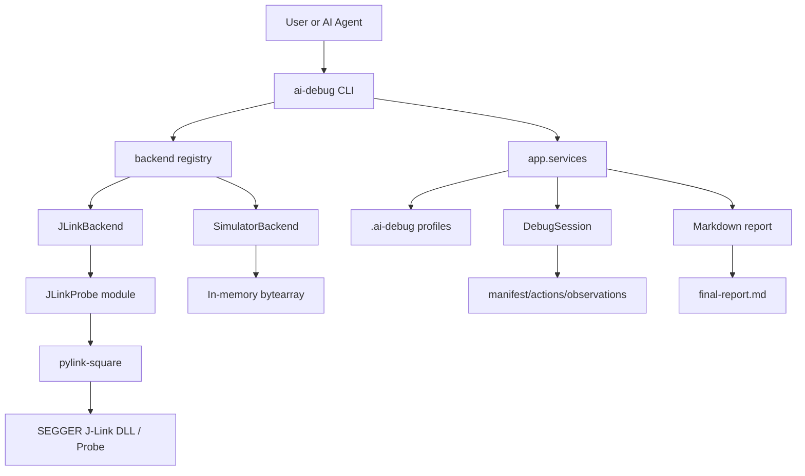
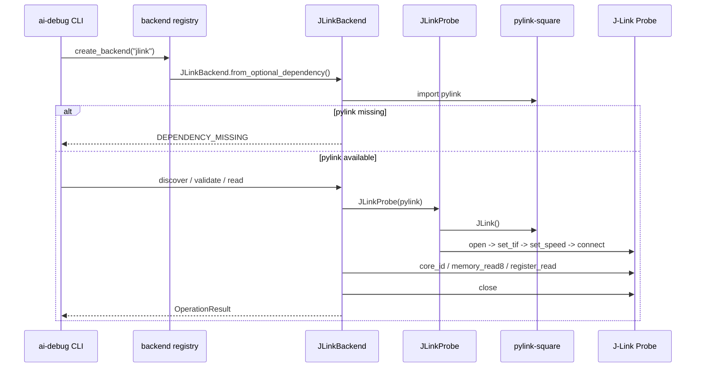
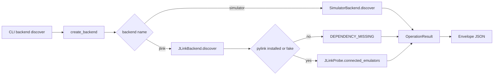
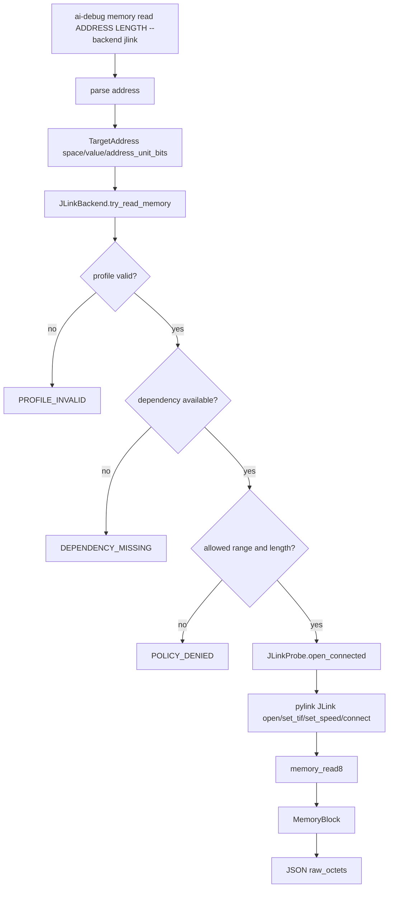
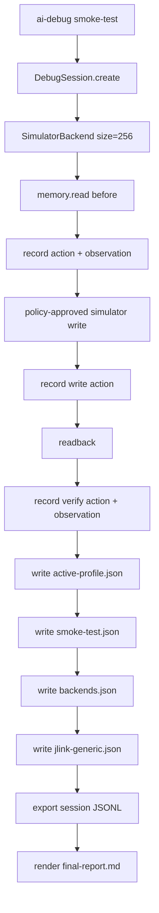

# AI Debug Kit 架构说明

版本：v0.2.0
位置：`F:\Study\AI\AiCoding\CodingKit\tests\ai-debug-kit`
状态：平台化、模块化、只读 J-Link backend 已接入；C2000/C28x 已作为 target profile 扩展方向建模，但尚未实现真实 TI DSS/XDS backend。

## 1. 目标与边界

AI Debug Kit 是一个面向 AI Agent 和嵌入式调试场景的 host-side debug kit。它的核心目标不是替代具体芯片厂商 IDE，也不是直接做业务 root cause 分析，而是提供一套可复用、可审计、可扩展的调试执行框架。

当前 v0.2 的能力边界：

- 提供统一 CLI：`ai-debug`。
- 所有 CLI 输出支持稳定 JSON envelope。
- 提供可插拔 backend registry。
- 已有 `simulator` backend 作为无硬件验证基线。
- 已有 `jlink` backend，通过 `pylink-square` 打通 Python 到 SEGGER J-Link 的只读路径。
- J-Link 被建模为 probe/transport 模块，不绑定 ARM-only 假设。
- 支持 target profile：`device`、`interface`、`speed_khz`、`address_unit_bits`、`endianness`、`architecture`、`core`、`allowed_memory_ranges`。
- 支持 C2000/C28x profile 元数据和 16-bit address unit 建模。
- 默认不实现 flash、reset、halt、任意写内存和目标状态破坏性操作。

不属于当前 v0.2 范围：

- 真实 C2000 TI DSS/XDS backend。
- Flash 下载和擦写。
- reset/halt/run 控制。
- RAM write 到真实目标。
- ELF/DWARF 符号变量解析。
- RTT/SWO streaming。
- 业务级根因判断，例如 FOC 调参、EtherCAT 诊断、OTA 策略判断。

## 2. 技术栈

| 层级 | 技术 | 用途 |
| --- | --- | --- |
| 语言 | Python 3.11+ | host-side CLI、backend、session、report |
| 包管理 | uv | 虚拟环境、依赖安装、测试运行 |
| 测试 | pytest | unit、contract、CLI 测试 |
| J-Link Python 库 | `pylink-square` optional extra | 真实 J-Link probe discovery/connect/read |
| CLI | argparse | `ai-debug` 命令入口 |
| 数据格式 | JSON / JSONL / Markdown | envelope、profile、session、report |
| 目标 shim | C99 模板 | 后续嵌入式目标端 debug shim 参考 |
| 参考仓库 | Mklink-AI-Probe | Skill、references、CLI 组织结构参考 |
| DSP 参考 | DSS_DataVisualizer | 后续 TI DSS/XDS backend 设计参考 |

依赖声明在 `pyproject.toml`：

```toml
[project]
name = "ai-debug-kit"
version = "0.2.0"
requires-python = ">=3.11"

[project.scripts]
ai-debug = "ai_debug.cli:main"

[project.optional-dependencies]
jlink = ["pylink-square>=2.0.1"]

[dependency-groups]
dev = ["pytest>=9.1.1"]
```

## 3. 目录结构

```text
ai-debug-kit/
├─ pyproject.toml
├─ uv.lock
├─ README.md
├─ docs/
│  ├─ ai-debug-kit-architecture.md
│  ├─ references/
│  │  └─ dss-datavisualizer.md
│  └─ superpowers/plans/
├─ src/ai_debug/
│  ├─ __init__.py
│  ├─ __main__.py
│  ├─ cli.py
│  ├─ app/
│  │  └─ services.py
│  ├─ backends/
│  │  ├─ base.py
│  │  ├─ registry.py
│  │  ├─ simulator.py
│  │  └─ jlink.py
│  ├─ core/
│  │  ├─ address.py
│  │  ├─ capability.py
│  │  ├─ policy.py
│  │  ├─ result.py
│  │  └─ session.py
│  ├─ probes/
│  │  └─ jlink.py
│  ├─ reports/
│  │  └─ markdown.py
│  └─ target_shim/
│     ├─ include/ai_debug_target_shim.h
│     └─ src/ai_debug_target_shim.c
├─ tests/
└─ _external/
   └─ Mklink-AI-Probe/
```

生成产物目录：

```text
.ai-debug/
├─ deployment/
│  ├─ active-profile.json
│  ├─ smoke-test.json
│  └─ backends.json
├─ targets/
│  └─ jlink-generic.json
└─ sessions/
   └─ dbg-*/
      ├─ manifest.json
      ├─ actions.jsonl
      ├─ observations.jsonl
      └─ final-report.md
```

## 4. 总体架构



核心分层：

| 层 | 模块 | 职责 |
| --- | --- | --- |
| CLI 层 | `ai_debug.cli` | 参数解析、命令分发、JSON envelope 输出 |
| 应用服务层 | `ai_debug.app.services` | doctor、smoke-test、profile、backend 状态、session/report 生成 |
| Backend 抽象层 | `ai_debug.backends.base` | 定义 `DebugBackend` 协议和 `MemoryBlock` |
| Backend 注册层 | `ai_debug.backends.registry` | 管理 backend 名称和实例创建 |
| Backend 实现层 | `simulator.py` / `jlink.py` | 实现 discover、validate、capabilities、memory/register read |
| Probe 层 | `ai_debug.probes.jlink` | 封装 `pylink-square`，避免向 core/app 泄漏 pylink 对象 |
| Core 层 | `address` / `capability` / `policy` / `result` / `session` | 地址、能力、风险策略、结果模型、会话记录 |
| Report 层 | `reports.markdown` | 根据 session 和 profile 生成 markdown 报告 |
| Target shim | `target_shim` | 后续目标端轻量集成模板 |

## 5. Backend 接口设计

统一接口定义在 `src/ai_debug/backends/base.py`：

```python
class DebugBackend(Protocol):
    def discover(self) -> OperationResult: ...
    def validate(self) -> OperationResult: ...
    def capabilities(self) -> Capabilities: ...
    def read_memory(self, address: TargetAddress, octet_length: int) -> MemoryBlock: ...
    def try_read_memory(self, address: TargetAddress, octet_length: int) -> OperationResult: ...
    def try_read_register(self, name: str) -> OperationResult: ...
```

设计原则：

- `discover()` 只发现 debug backend 或 probe，不代表目标业务调试成功。
- `validate()` 做连接和 identity 读取，但不做破坏性操作。
- `capabilities()` 明确声明 backend 能力，不靠命令名推断。
- `try_*` 返回 `OperationResult`，避免 CLI 层直接处理异常。
- `read_memory()` 是便捷 API，失败时抛 `ValueError`，主要供内部确定性场景使用。

当前 registry：

```python
def backend_names() -> list[str]:
    return ["jlink", "simulator"]
```

扩展新 backend 的最小步骤：

1. 新增 `src/ai_debug/backends/<name>.py`。
2. 实现 `DebugBackend` 协议。
3. 在 `registry.py` 中注册名称和工厂函数。
4. 增加 backend contract tests。
5. 增加 CLI tests 和 smoke/profile 输出检查。

## 6. J-Link 实现逻辑

J-Link 相关代码分为两层：

- `ai_debug.probes.jlink.JLinkProbe`：封装 `pylink-square` 具体 API。
- `ai_debug.backends.jlink.JLinkBackend`：实现平台统一 backend 协议、安全策略、target profile 检查和 JSON 可序列化结果。

连接流程：



J-Link backend 的关键安全点：

- `pylink-square` 是 optional dependency，未安装时返回 `DEPENDENCY_MISSING`。
- 支持 `AI_DEBUG_JLINK_FAKE=1`，测试时注入 `FakePylinkModule`。
- `JLinkBackend` 不把 pylink 对象暴露给 CLI、app 或 core。
- 读取前检查 `TargetProfile`。
- 读取前检查 `allowed_memory_ranges`。
- 读取前检查 `address_unit_bits`。
- 真实 backend 能力声明为只读：`memory_read=True`，`memory_write=False`，`flash=False`。
- 每次 validate/read/register read 都在 finally 中 close link。

当前 J-Link target profile：

```json
{
  "backend": "jlink",
  "device": "",
  "interface": "swd",
  "speed_khz": 4000,
  "address_unit_bits": 8,
  "endianness": "little",
  "architecture": "generic",
  "core": "default",
  "allowed_memory_ranges": [
    {"space": "data", "start": "0x20000000", "length": 65536}
  ]
}
```

C2000/C28x 当前只作为 profile 建模：

```text
architecture = c28x
core examples = cpu1, cpu2, cm
address_unit_bits = 16
transport direction = future TI DSS/XDS backend
```

这意味着当前代码没有把 J-Link 等同于 ARM，也没有把 C2000 强行塞入 J-Link。真正的 C2000 硬件联调应做成独立 `ti_dss` backend，参考 DSS_DataVisualizer 的 TI CCS DSS/DebugServer + XDS/JTAG 路径。

## 7. Simulator 实现逻辑

`SimulatorBackend` 是无硬件基准 backend，用于：

- 验证 CLI 和 JSON envelope。
- 验证 backend contract。
- 验证 session 记录和 report 生成。
- 验证 policy gate。
- 在没有硬件时提供稳定 smoke-test。

实现特点：

- 内部 memory 是 `bytearray`。
- 支持 discover/validate/read/register read。
- 支持受 policy 控制的 `try_write_memory()`。
- 默认写操作需要 `Policy(read_only=False)` 且 `Approval(granted_levels={RiskLevel.L3})`。
- 只用于模拟器，真实 backend 不开放写操作。

## 8. 数据模型

### 8.1 TargetAddress

`TargetAddress` 表达目标地址：

```text
space: data/program 等地址空间
value: 数值地址
address_unit_bits: 地址单位位宽，ARM 常见 8，C28x 可为 16
```

这样可以避免把所有目标都假设成 byte-addressed ARM。

### 8.2 Capabilities

`Capabilities` 是 backend 能力声明，用于操作前判断：

```text
artifact_load
memory_read
memory_write
variable_read
telemetry_capture
fault_snapshot
flash
```

J-Link v0.2：

```text
memory_read = true
memory_write = false
flash = false
```

Simulator：

```text
memory_read = true
memory_write = true
variable_read = true
telemetry_capture = true
fault_snapshot = true
flash = false
```

### 8.3 OperationResult 与 Envelope

`OperationResult` 是内部操作结果：

```text
ok
code
message
data
warnings
side_effects
```

`Envelope` 是 CLI 输出格式：

```json
{
  "schema_version": "1.0",
  "ok": true,
  "code": "OK",
  "message": "Operation completed",
  "data": {},
  "warnings": [],
  "side_effects": [],
  "duration_ms": 0,
  "trace_id": "",
  "session_id": ""
}
```

常见错误码：

| code | 含义 |
| --- | --- |
| `OK` | 操作成功 |
| `INVALID_ARGUMENT` | 参数或地址范围非法 |
| `POLICY_DENIED` | 安全策略拒绝 |
| `DEPENDENCY_MISSING` | optional dependency 未安装 |
| `PROFILE_INVALID` | target profile 缺少必要字段，例如 J-Link device |
| `IO_ERROR` | probe、库或硬件 IO 错误 |

## 9. CLI 命令面

当前命令：

```powershell
uv run ai-debug version --output json
uv run ai-debug doctor --output json
uv run ai-debug smoke-test --workspace . --output json
uv run ai-debug backend list --output json
uv run ai-debug backend discover --backend jlink --output json
uv run ai-debug backend validate --backend jlink --output json
uv run ai-debug backend capabilities --backend jlink --output json
uv run ai-debug memory read 0x20000000 4 --backend jlink --output json
uv run ai-debug register read R0 --backend jlink --output json
```

Fake J-Link 测试入口：

```powershell
$env:AI_DEBUG_JLINK_FAKE='1'
uv run ai-debug backend validate --backend jlink --output json
uv run ai-debug memory read 0x20000000 4 --backend jlink --output json
```

真实 J-Link 依赖安装：

```powershell
uv sync --extra jlink
```

真实 J-Link 配置环境变量：

```powershell
$env:AI_DEBUG_JLINK_DEVICE='YourDeviceName'
$env:AI_DEBUG_JLINK_INTERFACE='swd'
$env:AI_DEBUG_JLINK_SPEED_KHZ='4000'
```

## 10. 核心数据流

### 10.1 backend discover



### 10.2 J-Link memory read



### 10.3 smoke-test



## 11. Session 与证据记录

`DebugSession` 负责把调试执行变成可回放证据。

每个 session 包含：

- `manifest.json`：session 元信息。
- `actions.jsonl`：每一步操作，包括 operation、risk_level、approved、result_code、side_effects、details。
- `observations.jsonl`：读取到的数据或验证观察。
- `final-report.md`：人类可读报告。

示例 action 字段：

```json
{
  "action_id": "act-001",
  "operation": "memory.read",
  "requested_by": "codex",
  "risk_level": "L1",
  "approved": true,
  "result_code": "OK",
  "side_effects": [],
  "details": {"address": 16, "octet_length": 4}
}
```

设计收益：

- Agent 行为可审计。
- 操作风险和审批状态可追踪。
- 报告不直接替代业务结论，只记录确定性证据。
- 后续可扩展为 CI artifact、PR 附件或硬件在环测试记录。

## 12. 安全策略

风险等级在 `core.policy` 中建模：

| 等级 | 当前语义 |
| --- | --- |
| L0 | 无风险查询 |
| L1 | 只读观察，例如 memory/register read |
| L2 | 低风险验证或状态查询 |
| L3 | 需要显式批准的写操作 |
| L4 | 更高风险目标控制 |
| L5 | Flash、破坏性操作或不可逆操作 |

当前执行原则：

- J-Link v0.2 只开放 L1 只读能力。
- Simulator write 是 L3，只在 smoke-test 中带显式 policy/approval。
- Flash/reset/halt/write 对真实 backend 默认不实现。
- capability 查询不能替代 policy 检查。
- target profile allowed range 是真实 memory read 的前置约束。

## 13. 测试体系

当前测试覆盖：

| 测试文件 | 覆盖点 |
| --- | --- |
| `test_backend_registry.py` | backend registry 名称和创建逻辑 |
| `test_simulator_backend.py` | simulator read/write/policy/range |
| `test_jlink_backend.py` | fake pylink discover/connect/read/register、dependency missing、range deny、C2000 profile |
| `test_cli.py` | version/doctor/smoke-test CLI |
| `test_cli_jlink.py` | J-Link backend CLI fake path |
| `test_smoke_flow.py` | `.ai-debug` 产物生成 |
| `test_target_shim_static.py` | C target shim 静态存在性检查 |

推荐验证命令：

```powershell
uv run pytest -q
uv run ai-debug version --output json
$env:AI_DEBUG_JLINK_FAKE='1'; uv run ai-debug backend validate --backend jlink --output json
$env:AI_DEBUG_JLINK_FAKE='1'; uv run ai-debug memory read 0x20000000 4 --backend jlink --output json
uv run ai-debug smoke-test --workspace . --output json
```

当前最近一次验证结果：

```text
20 passed
```

## 14. Skill 集成

Kit 内置两个 Codex skill：

```text
.agents/skills/ai-debug-kit-deploy
.agents/skills/ai-debug-operations
```

角色划分：

- deploy skill：负责安装、doctor、smoke-test、backend 检测、profile 生成。
- operations skill：负责调试操作生命周期、安全检查、active profile/capability/allowed range 检查。

Skill 的定位是把 debug kit 变成 Agent 可复用工具，而不是只给人手动执行 CLI。

## 15. Git 集成与同步管理

当前 AI Debug Kit 位于主工作区子目录：

```text
F:\Study\AI\AiCoding\CodingKit\tests\ai-debug-kit
```

当前实现没有强制要求 kit 自身成为独立 Git repository；更合适的管理方式取决于后续用途。

### 15.1 推荐分层

| 内容 | 建议 Git 管理方式 |
| --- | --- |
| `src/` | 必须纳入版本控制 |
| `tests/` | 必须纳入版本控制 |
| `docs/` | 必须纳入版本控制 |
| `.agents/skills/` | 必须纳入版本控制，保证 Agent 行为可复现 |
| `pyproject.toml` / `uv.lock` | 必须纳入版本控制，锁定依赖行为 |
| `_external/Mklink-AI-Probe` | 作为参考快照或 submodule 二选一 |
| `.ai-debug/sessions/` | 默认不建议长期纳入主线，可作为 CI artifact 或问题附件 |
| `.ai-debug/deployment/*.json` | 可按场景决定；若用于环境基线，可纳入；若含本机路径，应忽略或模板化 |
| `.venv/` / `.pytest_cache/` | 不纳入版本控制 |

### 15.2 建议 `.gitignore`

如果 kit 作为独立仓库，建议添加：

```gitignore
.venv/
.pytest_cache/
__pycache__/
*.pyc
.ai-debug/sessions/
.ai-debug/deployment/smoke-test.json
.ai-debug/deployment/active-profile.json
```

对于 `backends.json` 和 `jlink-generic.json`：

- 如果用于记录某台机器的检测结果，建议忽略。
- 如果作为默认 profile 模板，建议复制为 `docs/examples/` 或 `.ai-debug/targets/*.template.json` 后纳入版本控制。

### 15.3 同步策略

推荐同步流程：

```text
1. 修改代码或文档
2. 运行 uv run pytest -q
3. 运行关键 CLI smoke-test
4. 检查 git diff --check
5. 检查 git status --short
6. 按功能范围提交 commit
7. 推送到远端或同步到主工作区
```

推荐 commit 粒度：

- `feat(backends): add read-only jlink backend`
- `docs(architecture): document ai debug kit architecture`
- `test(jlink): add fake pylink contract tests`
- `chore(deps): add optional pylink-square extra`

### 15.4 外部参考仓库管理

当前 `_external/Mklink-AI-Probe` 是参考模板，不是 v0.2 runtime dependency。

可选管理方式：

1. 快照模式：保留当前拷贝，记录来源和更新时间。
2. submodule 模式：使用 Git submodule 固定 upstream commit。
3. sparse checkout 模式：只同步需要参考的 `SKILL.md`、`references/`、核心 Python CLI 模块。

当前建议：短期使用快照模式，等 kit 独立成仓库后再改成 submodule 或文档链接，避免把参考仓库的大量 GUI/build 产物混入 debug kit 主线。

## 16. 后续演进路线

优先级建议：

1. 完善 J-Link profile 加载：从 `.ai-debug/targets/*.json` 读取，而不是只靠环境变量和默认值。
2. 为 J-Link read 操作增加 session 记录，做到真实 hardware read 也能生成 actions/observations。
3. 增加 HIL smoke test：必须显式设置 `AI_DEBUG_JLINK_HIL=1`、device、serial、allowed range。
4. 新增 `ti_dss` backend：面向 C2000/C28x、C6000、MSP430 等 TI DSS/XDS 调试链路。
5. 增加 symbol/profile 层：ELF/DWARF、map 文件、变量名到地址映射。
6. 增加只读 telemetry：RTT/SWO/DSS expression polling，但保持 capability 和 policy gate。
7. 将 `.ai-debug` 产物标准化为 CI artifact schema。

## 17. 当前验收标准

本架构当前满足以下标准：

- 所有代码和文档均位于 `F:\Study\AI\AiCoding\CodingKit\tests\ai-debug-kit` 内。
- `simulator` 和 `jlink` 走同一 `DebugBackend` 协议。
- J-Link Python 库使用 `pylink-square` optional extra。
- 未安装 `pylink-square` 时返回 `DEPENDENCY_MISSING`，不会 import crash。
- J-Link backend 默认只读，不提供 flash/reset/write。
- C2000/C28x 没有被当作 ARM；通过 `architecture/core/address_unit_bits` profile 建模。
- `DSS_DataVisualizer` 被记录为未来 TI DSS/XDS backend 参考，而不是当前 runtime dependency。
- `uv run pytest -q` 通过。
## 18. 当前已经完成的实现

截至当前版本，AI Debug Kit 已经完成以下内容。

### 18.1 已完成的代码实现

- 已创建 Python 包 `ai-debug-kit`，版本为 `0.2.0`。
- 已建立 `src/ai_debug` 分层结构：CLI、app services、core、backends、probes、reports、target_shim。
- 已实现 `ai-debug` CLI 入口。
- 已实现统一 JSON envelope 输出模型。
- 已实现 `DebugBackend` 协议，作为后续 backend 的统一接口。
- 已实现 backend registry，当前注册 `jlink` 和 `simulator`。
- 已实现 `SimulatorBackend`，用于无硬件 smoke-test 和 contract 测试。
- 已实现 `JLinkBackend`，通过 optional `pylink-square` 连接 Python 与 J-Link。
- 已实现 `JLinkProbe` 模块，封装 pylink 对象，避免 app/core 直接依赖 pylink。
- 已实现 fake pylink 测试模块，用于无硬件单元测试。
- 已实现 `TargetProfile`，包含 `architecture`、`core`、`address_unit_bits`、`allowed_memory_ranges` 等字段。
- 已加入 C2000/C28x profile 建模：`architecture=c28x`、`address_unit_bits=16`、`core` 示例为 `cpu1/cpu2/cm`。
- 已实现 policy/risk/approval 基础模型。
- 已实现 debug session 记录：`actions.jsonl`、`observations.jsonl`、`manifest.json`。
- 已实现 smoke-test 报告生成：`final-report.md`。
- 已实现 `.ai-debug/deployment/backends.json` 和 `.ai-debug/targets/jlink-generic.json` 生成。

### 18.2 已完成的 CLI 能力

当前 CLI 已支持：

```powershell
ai-debug version
ai-debug doctor
ai-debug smoke-test
ai-debug backend list
ai-debug backend discover --backend simulator|jlink
ai-debug backend validate --backend simulator|jlink
ai-debug backend capabilities --backend simulator|jlink
ai-debug memory read ADDRESS LENGTH --backend simulator|jlink
ai-debug register read NAME --backend simulator|jlink
```

J-Link 当前只开放只读能力：

- probe discovery
- connect/validate
- target identity 读取
- capabilities 查询
- memory read
- register read

未实现并且默认禁止：

- flash
- reset
- halt
- run control
- 任意 memory write
- RAM patch
- 真实目标写寄存器

### 18.3 已完成的测试

已建立 pytest 测试覆盖：

- backend registry 测试。
- simulator backend 测试。
- fake J-Link backend 测试。
- missing dependency 测试。
- memory allowed range / policy denied 测试。
- C2000/C28x target profile 测试。
- CLI JSON 输出测试。
- smoke-test 产物生成测试。
- C target shim 静态检查。

最近一次完整验证：

```text
uv run pytest -q
20 passed
```

### 18.4 已完成的文档与参考

已完成：

- `README.md`：快速启动、J-Link optional extra、平台边界。
- `docs/references/dss-datavisualizer.md`：说明 DSS_DataVisualizer 是未来 TI DSS/XDS backend 参考，不是当前 J-Link backend runtime dependency。
- `docs/ai-debug-kit-architecture.md`：当前架构总说明。
- `.agents/skills/ai-debug-kit-deploy`：部署/验证 skill。
- `.agents/skills/ai-debug-operations`：调试操作生命周期 skill。

### 18.5 已经发生但需要按最新要求收敛的插件产物

在你明确“先写架构即可，不需要实际做法”之前，已经按 Codex plugin scaffold 生成过一个插件骨架目录：

```text
CodingKit/tests/ai-debug-kit/plugins/aicoding-ai-debug-kit/
```

该目录当前属于“已生成的 staged plugin draft”，不是最终确认的插件交付。它包含：

- `.codex-plugin/plugin.json`
- `skills/ai-debug-kit-deploy`
- `skills/ai-debug-operations`
- `assets/ai-debug-kit` 源码快照

按你的最新要求，后续不应继续扩展这个插件目录；如果要严格回到“只写架构文档”，该目录可以作为一次未确认落地尝试删除或保留为草稿，取决于后续你的确认。

## 19. 参考 AiCoding 的插件化同步架构方案

本节只描述架构方案，不代表已经完成实际同步落地。

### 19.1 AiCoding 当前同步形态

当前工作区远端为：

```text
https://github.com/JiaxI2/AiCoding.git
```

本地已存在的同步结构：

```text
.agents/plugins/marketplace.json
dist/agent-patch-kit/plugins/AiCodingAgentPatch/
CodingKit/agents/skills  ->  https://github.com/JiaxI2/Codex-Skills.git submodule
```

`Agent-Patch-Kit` 的模式是：

- 插件分发包放在 `dist/agent-patch-kit/plugins/AiCodingAgentPatch`。
- 插件必须包含 `.codex-plugin/plugin.json`。
- skill 放在插件内 `skills/`。
- CLI/runtime 资产放在插件内 `assets/`。
- Marketplace 通过 `.agents/plugins/marketplace.json` 指向本地插件路径。

`Codex-SKILLs` 的模式是：

- `CodingKit/agents/skills` 作为 submodule。
- AiCoding 主仓库只固定 submodule 指针。
- skill 的 canonical source 不在主仓库里重新复制维护。
- 更新策略是更新 submodule 指针，而不是在多个位置手工分叉同一份 skill。

### 19.2 AI Debug Kit 推荐插件形态

AI Debug Kit 后续应作为 AiCoding 的第三类本地插件包，建议名称：

```text
aicoding-ai-debug-kit
```

推荐最终分发路径：

```text
dist/ai-debug-kit/plugins/AiCodingAIDebugKit/
```

推荐 marketplace 入口：

```json
{
  "name": "aicoding-ai-debug-kit",
  "source": {
    "source": "local",
    "path": "./dist/ai-debug-kit/plugins/AiCodingAIDebugKit"
  },
  "policy": {
    "installation": "AVAILABLE",
    "authentication": "ON_INSTALL"
  },
  "category": "Developer Tools"
}
```

推荐插件目录：

```text
AiCodingAIDebugKit/
├─ .codex-plugin/
│  └─ plugin.json
├─ README.md
├─ skills/
│  ├─ ai-debug-kit-deploy/
│  └─ ai-debug-operations/
└─ assets/
   └─ ai-debug-kit/
      ├─ pyproject.toml
      ├─ uv.lock
      ├─ README.md
      ├─ src/
      ├─ tests/
      └─ docs/
```

### 19.3 插件 manifest 建议

```json
{
  "name": "aicoding-ai-debug-kit",
  "version": "0.2.0",
  "displayName": "AiCoding AI Debug Kit",
  "description": "Reusable platform-oriented AI debug kit with simulator and read-only J-Link backend support.",
  "category": "Developer Tools"
}
```

如果使用新版 Codex plugin manifest schema，也可以保留 `interface` 字段，但必须通过 `plugin-creator` 的 `validate_plugin.py` 校验。

### 19.4 同步责任边界

推荐将 AI Debug Kit 拆成三个同步层：

| 层 | 推荐位置 | 责任 |
| --- | --- | --- |
| 开发源 | `CodingKit/tests/ai-debug-kit` 或后续独立仓库 | 开发、测试、文档、原始源码 |
| 插件分发包 | `dist/ai-debug-kit/plugins/AiCodingAIDebugKit` | Codex Marketplace 可安装插件 |
| Marketplace 索引 | `.agents/plugins/marketplace.json` | 暴露给 Codex app 的本地插件入口 |

不要把运行时产物放入插件分发包：

- `.venv/`
- `.pytest_cache/`
- `.ai-debug/sessions/`
- 本机 smoke-test 结果
- 真实硬件连接记录

可以放入插件分发包：

- `src/`
- `tests/`
- `docs/`
- `pyproject.toml`
- `uv.lock`
- `README.md`
- skills
- 安装/验证脚本

### 19.5 与 Codex-SKILLs 的关系

有两种可选方案。

方案 A：AI Debug Kit skill 跟随插件包分发。

- `skills/ai-debug-kit-deploy` 和 `skills/ai-debug-operations` 直接随插件发布。
- 优点：安装插件即可获得 skill 和 CLI assets。
- 缺点：skill canonical source 与 `Codex-SKILLs` submodule 分离，需要同步脚本保持一致。

方案 B：AI Debug Kit skill 进入 `Codex-SKILLs` submodule，插件只引用/打包快照。

- canonical source 放在 `CodingKit/agents/skills` 对应的 Codex-SKILLs 仓库。
- AiCoding 主仓库更新 submodule 指针。
- 插件分发包在 release/stage 阶段从 submodule 拷贝 skill。
- 优点：符合现有 Codex-SKILLs 同步策略。
- 缺点：多一个 release packaging 步骤。

推荐方案：B。

理由：AiCoding 已经用 submodule 管理 Codex-SKILLs，AI Debug Kit skill 如果长期维护，应进入同一 canonical skill 源，插件包只作为分发快照。

### 19.6 推荐同步流程

```text
1. 在开发源目录修改 AI Debug Kit 代码、测试、文档。
2. 运行 uv run pytest -q。
3. 运行 ai-debug smoke-test。
4. 如果 skill 有变化，同步到 Codex-SKILLs canonical source。
5. 更新 AiCoding 中 CodingKit/agents/skills submodule 指针。
6. 生成 dist/ai-debug-kit/plugins/AiCodingAIDebugKit 插件快照。
7. 校验 .codex-plugin/plugin.json。
8. 更新 .agents/plugins/marketplace.json，加入 aicoding-ai-debug-kit 入口。
9. 执行 git diff --check 和 git status --short。
10. 按源码、skill、plugin packaging 分开 commit。
```

### 19.7 推荐脚本化任务

后续可以增加脚本，但当前只做架构描述：

```text
scripts/package-ai-debug-kit-plugin.ps1
scripts/verify-ai-debug-kit-plugin.ps1
scripts/sync-ai-debug-kit-skills.ps1
```

职责建议：

- `package-ai-debug-kit-plugin.ps1`：从开发源生成 `dist/ai-debug-kit/plugins/AiCodingAIDebugKit`。
- `verify-ai-debug-kit-plugin.ps1`：运行 pytest、插件 manifest 校验、marketplace path 校验。
- `sync-ai-debug-kit-skills.ps1`：检查开发源 skill 与 Codex-SKILLs canonical source 是否一致。

### 19.8 插件化后的验收标准

当真正执行插件化落地时，至少满足：

- `dist/ai-debug-kit/plugins/AiCodingAIDebugKit/.codex-plugin/plugin.json` 通过 Codex plugin validation。
- `.agents/plugins/marketplace.json` 增加 `aicoding-ai-debug-kit`。
- 插件内包含两个 skills。
- 插件内 assets 可独立安装并运行 `uv run pytest -q`。
- 不包含 `.venv`、`.ai-debug/sessions`、真实硬件私有记录。
- J-Link optional dependency 仍通过 `uv sync --extra jlink` 获取，不强制安装。
- Codex-SKILLs canonical source 与插件内 skill 快照有明确同步检查。
