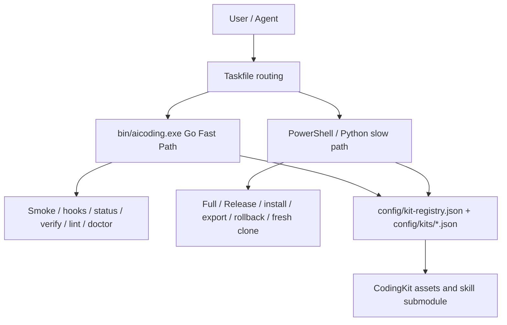

# AiCoding

AiCoding is the platform integration, installation, governance, and CodingKit asset repository for the local AI coding workflow. It owns the platform glue around kits, hooks, verification, and release governance; it does not own embedded skill source code.

[中文](README_CN.md) | [English](README_EN.md)

## 项目定位 / Project Positioning

- Platform repository: integrates CodingKit assets, kit registry, local hooks, Taskfile routing, release governance, and Go Fast Path checks.
- Source boundary: authoritative skill/plugin source is the `CodingKit/agents/skills` submodule and related generated package assets.
- Runtime boundary: installed plugin/runtime state is managed through documented install/update workflows, not by editing Codex caches directly.
- Release boundary: platform releases use platform tags; kit/component releases use separate namespaces.

## 当前架构 / Current Architecture

AiCoding has two local execution lanes:

- Go Fast Path: hot local checks for Smoke, hooks, status, repo text, release-note presence, governance lint, and performance probes.
- PowerShell/Python slow path: Full/Release, install/uninstall/export, fresh clone, rollback, package, and compatibility workflows.

The Go lane reduces repeated PowerShell cold starts. It does not replace the Full/Release gates.

## 环境预览 / Environment Preview

| Area | Current default | Details |
|---|---|---|
| Human entry | `task smoke`, `task perf` | [docs/COMMANDS.md](docs/COMMANDS.md) |
| Go CLI | `bin/aicoding.exe` | [docs/FAST_PATH_COMMANDS.md](docs/FAST_PATH_COMMANDS.md) |
| Full/Release | PowerShell/Python scripts | [docs/POWERSHELL_MIGRATION.md](docs/POWERSHELL_MIGRATION.md) |
| Kit model | registry + manifests | [config/kit-registry.json](config/kit-registry.json) |
| Release governance | tag namespace policy | [docs/TAGGING_POLICY.md](docs/TAGGING_POLICY.md) |

## 环境 URL / Environment URLs

| Target | URL |
|---|---|
| Repository | https://github.com/JiaxI2/AiCoding |
| Latest release | https://github.com/JiaxI2/AiCoding/releases/latest |
| Releases | https://github.com/JiaxI2/AiCoding/releases |
| Tags | https://github.com/JiaxI2/AiCoding/tags |
| Changelog | [CHANGELOG.md](CHANGELOG.md) |
| CodingKit | [CodingKit/README.md](CodingKit/README.md) |

## 中英文切换 / Language Switch

- 中文入口：[README_CN.md](README_CN.md)
- English entry：[README_EN.md](README_EN.md)
- Bilingual short entry：this file.

## 快速开始 / Quick Start

```powershell
go build -o bin/aicoding.exe ./cmd/aicoding
task smoke
task perf
bin\aicoding.exe status --all --json
```

Use `task full` and `task release` only when explicit Full/Release validation is required.

## 当前架构图 / Architecture Diagram



## 重要文档索引 / Documentation Index

| Need | Document |
|---|---|
| Architecture overview | [docs/ARCHITECTURE_OVERVIEW.md](docs/ARCHITECTURE_OVERVIEW.md) |
| Fast Path commands | [docs/FAST_PATH_COMMANDS.md](docs/FAST_PATH_COMMANDS.md) |
| Full command matrix | [docs/COMMANDS.md](docs/COMMANDS.md) |
| PowerShell migration map | [docs/POWERSHELL_MIGRATION.md](docs/POWERSHELL_MIGRATION.md) |
| Release governance overlay | [docs/RELEASE_GOVERNANCE_OVERLAY.md](docs/RELEASE_GOVERNANCE_OVERLAY.md) |
| Tag policy | [docs/TAGGING_POLICY.md](docs/TAGGING_POLICY.md) |
| Release policy | [docs/RELEASE_POLICY.md](docs/RELEASE_POLICY.md) |
| Fast Path architecture v1 | [docs/AICODING_FAST_PATH_ARCHITECTURE_V1.md](docs/AICODING_FAST_PATH_ARCHITECTURE_V1.md) |

## Git 治理标准 / Git Governance Standard

Commit type taxonomy: `feat`, `fix`, `docs`, `style`, `refactor`, `perf`, `test`, `build`, `ci`, `chore`.

Branch naming and environment mapping: `main` is the platform baseline; `develop`, `feature/*`, `test/*`, `release/*`, and `hotfix/*` describe integration, feature, test, release, and hotfix work.

Release notes must be typed by primary change type / 发布说明按主类型汇总, and Tag/Release language is Chinese-first bilingual for platform releases.
## Release / Tag 简短规则

- Platform releases: `vMAJOR.MINOR.PATCH`, for example `v0.2.0`.
- Kit/component releases: `kit/<kit-id>/vMAJOR.MINOR.PATCH`.
- Milestones: `milestone/YYYY.MM.DD-<name>`.
- Do not publish component releases as pseudo platform tags such as `v1.3.0-powershell-skill-kit`.
- Do not move or reuse immutable release-bound tags.
