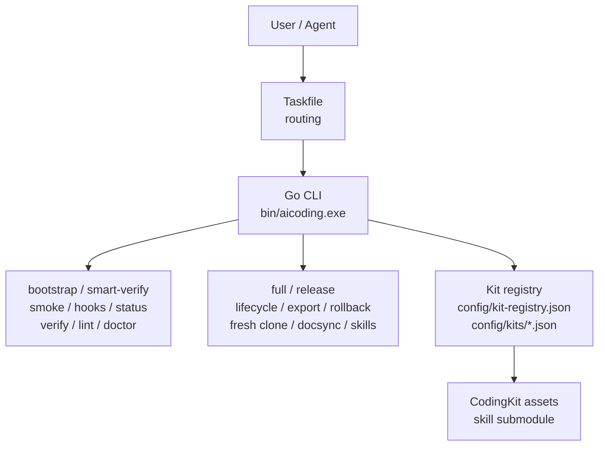

# AiCoding

[](https://github.com/JiaxI2/AiCoding/releases/latest)
[](https://go.dev/)
[](https://learn.microsoft.com/powershell/)
[](https://www.python.org/)
[](https://taskfile.dev/)
[](LICENSE)

AiCoding 是本地 AI coding 工作流的平台集成、安装、治理与 CodingKit 资产仓库。
它负责 kit 注册表、hook、验证入口、发布治理和 Go Fast Path；它不拥有嵌入式 skill 源码。

[中文](README_CN.md) | [English](README_EN.md)

## 项目定位 / Project Positioning

- 平台仓库：集成 CodingKit 资产、kit registry、本地 hook、Taskfile 路由、发布治理和 Go Fast Path 检查。
- 源码边界：权威 skill/plugin 源码位于 `CodingKit/agents/skills` 子模块和对应生成资产。
- 运行边界：本地插件/runtime 状态通过安装、更新、验证流程管理，不直接修改 Codex cache。
- 发布边界：平台版本、kit/component 版本、milestone tag 分命名空间。

## 当前架构 / Current Architecture

AiCoding 本地执行路径以 Go CLI 为默认控制面：

- Go CLI：承担 bootstrap、smart-verify、Smoke、hook、status、repo text、release-notes、tag/release、governance lint、DocSync、skill verify、lifecycle、export、fresh-clone、Full 和 Release gate。
- PowerShell/Python：只保留尚未被本轮完整替代的兼容、专项质量、安全、计划模式和外部 skill 工作流。

Go 路径用于减少 PowerShell 冷启动并输出稳定 JSON，Full/Release gate 现在也由 Go 聚合。

## 环境预览 / Environment Preview

| 区域 | 当前默认 | 说明 |
|---|---|---|
| 人机入口 | `task setup`, `task smoke`, `task full`, `task release` | [docs/COMMANDS.md](docs/COMMANDS.md) |
| Go CLI | `bin/aicoding.exe bootstrap/workflow/cache/tag/release/docsync/lifecycle/export/fresh-clone` | [docs/FAST_PATH_COMMANDS.md](docs/FAST_PATH_COMMANDS.md) |
| Full/Release | `bin/aicoding.exe full --json`, `bin/aicoding.exe release gate --json` | [docs/COMMANDS.md](docs/COMMANDS.md) |
| Kit 模型 | registry + manifests | [config/kit-registry.json](config/kit-registry.json) |
| 发布治理 | tag namespace policy | [docs/TAGGING_POLICY.md](docs/TAGGING_POLICY.md) |

## 快速开始 / Quick Start

```powershell
go run ./cmd/aicoding bootstrap --json
bin\aicoding.exe workflow smart-verify --json
task smoke
bin\aicoding.exe docsync ci --json
bin\aicoding.exe skill verify --all --profile Smoke --json
bin\aicoding.exe release gate --json
```

完整本地验证和正式发布门禁也通过 `task full`、`task release` 路由到 Go CLI。

## 当前架构图 / Architecture Diagram



## 重要文档索引 / Documentation Index

| 需求 | 文档 |
|---|---|
| 架构总览 | [docs/ARCHITECTURE_OVERVIEW.md](docs/ARCHITECTURE_OVERVIEW.md) |
| Fast Path 命令 | [docs/FAST_PATH_COMMANDS.md](docs/FAST_PATH_COMMANDS.md) |
| 完整命令矩阵 | [docs/COMMANDS.md](docs/COMMANDS.md) |
| PowerShell 迁移分类 | [docs/POWERSHELL_MIGRATION.md](docs/POWERSHELL_MIGRATION.md) |
| Release governance overlay | [docs/RELEASE_GOVERNANCE_OVERLAY.md](docs/RELEASE_GOVERNANCE_OVERLAY.md) |
| Tag policy | [docs/TAGGING_POLICY.md](docs/TAGGING_POLICY.md) |
| Release policy | [docs/RELEASE_POLICY.md](docs/RELEASE_POLICY.md) |
| Fast Path architecture v1 (historical) | [docs/AICODING_FAST_PATH_ARCHITECTURE_V1.md](docs/AICODING_FAST_PATH_ARCHITECTURE_V1.md) |

## Git 治理标准 / Git Governance Standard

Commit type taxonomy：`feat`、`fix`、`docs`、`style`、`refactor`、`perf`、`test`、`build`、`ci`、`chore`。

Branch naming and environment mapping：`main` 是平台基线；`develop`、`feature/*`、`test/*`、`release/*`、`hotfix/*` 分别表示集成、功能、测试、发布和热修复工作。

Release notes 必须按主类型汇总；平台 Tag/Release 默认中文优先双语。

## Release / Tag 简短规则

- 平台发布 tag：`vMAJOR.MINOR.PATCH`，例如 `v0.2.0`。
- Kit/component 发布 tag：`kit/<kit-id>/vMAJOR.MINOR.PATCH`。
- Milestone tag：`milestone/YYYY.MM.DD-<name>`。
- 禁止继续把组件版本发布成 `v1.3.0-powershell-skill-kit` 这类伪平台 tag。
- 不移动、不覆盖、不复用已绑定 release 的 immutable tag。
