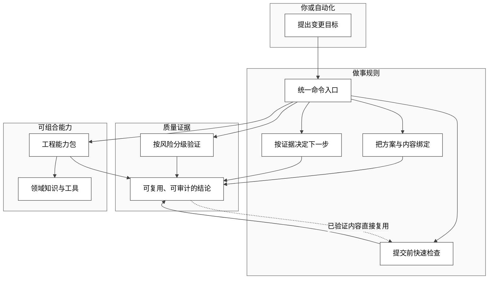

<p align="center">
  
  
</p>

<p align="center"><a href="README.md">仓库首页</a> · <a href="README_EN.md">English</a></p>

[](https://github.com/JiaxI2/AiCoding/releases/latest) [](https://github.com/JiaxI2/AiCoding/actions/workflows/aicoding-ci.yml) [](LICENSE) [](https://go.dev/doc/go1.22) [](https://go.dev/doc/devel/release#go1.26.5) [](https://github.com/dominikh/go-tools/releases/tag/2026.1) [](https://go.googlesource.com/vuln/+/refs/tags/v1.6.0) [](https://github.com/PowerShell/PowerShell/releases/tag/v7.0.0) [](https://docs.python.org/3.10/whatsnew/3.10.html) [](https://taskfile.dev/) [](https://github.com/llvm/llvm-project/releases/tag/llvmorg-17.0.2) [](docs/guides/C99_STANDARD_C_SKILL.md)

AiCoding 是让 AI 编码工作流可验证、可复用、可审计的本地工程平台：同一 Git 内容完整验证约 150 秒，重复检查约 424 毫秒，每个绿灯都能追溯到它验证的内容。

## 状态 / Status

面向 Windows 与自动化调用，所有正式入口都提供 JSON 结果；[CI](https://github.com/JiaxI2/AiCoding/actions/workflows/aicoding-ci.yml) 持续验证主线，[CHANGELOG](CHANGELOG.md) 与 [Releases](https://github.com/JiaxI2/AiCoding/releases) 记录可交付变化。

## 一张图看懂



## 快速开始 / Quick Start

在递归包含子模块的 clean clone 根目录，用 PowerShell 逐行复制这三行：

```powershell
go run ./cmd/aicoding bootstrap --json && .\bin\aicoding.exe provision --json
.\bin\aicoding.exe verify --profile Smoke --json
.\bin\aicoding.exe test --profile Smoke --json
```

第一行会从源码构建未入仓的本地二进制并完成仓库初始化；随后你应看到 `ok: true`，最终测试摘要应为 `conclusion: PASS`、`fail: 0`。任一步失败，先运行 `.\bin\aicoding.exe doctor --all --json`，再到[命令矩阵](docs/COMMANDS.md)按错误类别定位。

## 发展路线

静态方向见[架构路线图](docs/architecture/07-roadmap.md)；活的 roadmap 可直接用 `.\bin\aicoding.exe todolist --json` 查询，机器与人看到的是同一队列。

## 按角色进入

| 我是谁 | 我要什么 | 从这里开始 |
|---|---|---|
| 新用户 | 跑通第一个绿灯并继续探索 | 上面的三行 → [命令矩阵](docs/COMMANDS.md) |
| Agent / 自动化 | 稳定命令与 JSON 结果契约 | [命令矩阵](docs/COMMANDS.md) → [报告 schema](docs/operations/testing/REPORT_SCHEMA.md) |
| 贡献者 | 改代码而不越过架构红线 | [架构必读路径](docs/architecture/README.md) → [贡献指南](CONTRIBUTING.md) |
| Kit 作者 | 理解生命周期并跟踪“生成即合规”入口 | [Kit 生命周期](docs/architecture/KIT_LIFECYCLE_ARCHITECTURE.md) → [`kit init` 计划](docs/todolist/0010-kit-init-scaffold.md) |

## 内核与 Kit

冻结的六模块内核给出稳定底座，内容寻址证据让结论绑定 Git 内容，裁决式 loop 只决定下一步而不再造执行器；三者分别由[核心架构](docs/architecture/AICODING_CORE_ARCHITECTURE.md)、[验证证据](docs/decisions/0007-validation-evidence.md)与[循环工程架构](docs/architecture/LOOP_ENGINEERING_ARCHITECTURE.md)约束。

下表严格投影 `config/kit-registry.json` 当前全部 enabled Kit；能力句来自各 manifest，详情保持一行一链接。

| Kit | 一句话核心能力 | 详情 |
|---|---|---|
| `aicoding-platform` | AiCoding platform integration, Codex plugin marketplace registration, CodingKit asset discovery, and submodule validation. | [Kit / Plugin 视图](docs/reference/KIT_PLUGIN_VIEW.md) |
| `docsync-plus` | Semantic documentation drift detection kit for AiCoding repositories. | [DocSync Plus](docs/architecture/DOC_SYNC_PLUS_SPEC.md) |
| `reuse-governance` | Declarative governance for independently integrated reusable modules. | [复用治理](docs/operations/THIRD_PARTY_REUSE_GOVERNANCE.md) |
| `common-control-kit` | Reusable C99 control modules under CodingKit/modules/common/controller. | [控制模块](CodingKit/modules/common/controller/foc/README.md) |
| `c-userstyle-kit` | First-party C99 style, comment, lint, host-compile, and behavior verification assets backed by the Huawei DKBA 2826-2011&#46;5 reference. | [C UserStyle Kit](docs/guides/C99_STANDARD_C_SKILL.md) |
| `release-governance-overlay-kit` | Tag/release namespace governance, Taskfile entry, and performance-loop overlay for AiCoding. | [发布治理](docs/governance/RELEASE_GOVERNANCE_OVERLAY.md) |

## 为什么这个仓库越用越值钱

- **地基复利**：冻结内核只接受向上组合，新能力不推倒旧边界（[愿景与四象限](docs/architecture/00-vision.md)）。
- **证据复利**：同一内容完整验证一次，之后可跨 worktree 在约 424 毫秒内复用（[实测基线](docs/operations/VALIDATION_EVIDENCE_BUDGET.md)）。
- **能力复利**：loop、plan、验证证据和 Kit 生命周期共享既有 Primitive，而不是各建一套事实源（[Primitive Constitution](docs/architecture/PRIMITIVE_CONSTITUTION.md)）。
- **知识复利**：四象限中的每类不确定性都有对应沉淀位置，经验会变成下一次工作的输入（[愿景 §3](docs/architecture/00-vision.md)）。

## 当前架构

`Go CLI` 是唯一正式产品入口：`lifecycle` 管理能力，`doctor --all` / `verify --profile` / `test --profile` 产生分级结论，`release verify|gate` 守住发布。Taskfile 只做短路由，PowerShell/Python 只保留专项边界。完整分层见[架构阅读路径](docs/architecture/README.md)。

## Git 工作流 / Git Workflow

仓库遵循 [Git Governance Standard](docs/governance/RELEASE_POLICY.md)：commit type 为 `feat`, `fix`, `docs`, `style`, `refactor`, `perf`, `test`, `build`, `ci`, `chore`；分支映射为 `main`, `develop`, `feature`, `test`, `release`, `hotfix`；Release typed notes 按主类型汇总并由[发布说明门禁](.github/RELEASE_TEMPLATE.md)验证。

## 仓库导航 / Repository Navigation

| 需要 | 权威入口 |
|---|---|
| 理解架构 | [架构阅读路径](docs/architecture/README.md) |
| 查找命令 | [命令矩阵](docs/COMMANDS.md) |
| 查看验证标准 | [全局测试计划](docs/operations/testing/GLOBAL_TEST_PLAN.md) |
| 参与贡献 | [贡献指南](CONTRIBUTING.md) |
| 报告问题 | [Issues](https://github.com/JiaxI2/AiCoding/issues) |
| 安全报告 | [Security](SECURITY.md) |

## Star History

<a href="https://www.star-history.com/?repos=JiaxI2%2FAiCoding&type=date&legend=top-left">
  <picture>
    <source media="(prefers-color-scheme: dark)" srcset="https://api.star-history.com/chart?repos=JiaxI2/AiCoding&type=date&theme=dark&legend=top-left">
    <source media="(prefers-color-scheme: light)" srcset="https://api.star-history.com/chart?repos=JiaxI2/AiCoding&type=date&legend=top-left">
    
  </picture>
</a>
