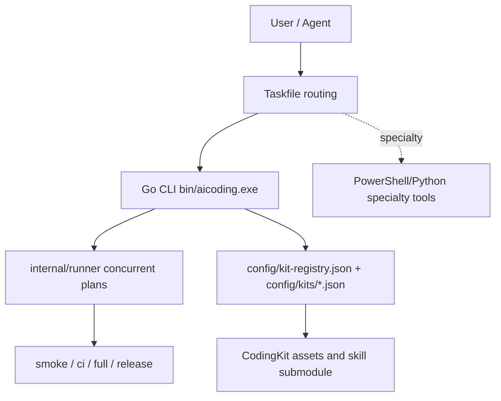

# AiCoding

[](https://github.com/JiaxI2/AiCoding/releases/latest)
[](https://go.dev/)
[](https://learn.microsoft.com/powershell/)
[](https://www.python.org/)
[](https://taskfile.dev/)
[](LICENSE)

AiCoding is the platform integration, installation, governance, and CodingKit asset repository for the local AI coding workflow. It owns kit registration, hooks, verification entrypoints, release governance, and the Go CLI control plane. It does not own embedded skill source code.

[中文](README_CN.md) | [English](README_EN.md)

## Project Boundary

- Platform repository: integrates CodingKit assets, kit registry, local hooks, Taskfile routing, release governance, and Go CLI gates.
- Source boundary: authoritative skill/plugin source lives in the `CodingKit/agents/skills` submodule and generated package assets.
- Runtime boundary: installed plugin/runtime state is managed through install, update, and verify workflows, not direct Codex cache edits.
- Release boundary: platform, kit/component, and milestone tags use separate namespaces.

## Current Architecture

The Go CLI is the default control plane. It owns bootstrap, Smoke, CI, hooks, status, repo text, release notes, tag/release structural checks, governance lint, DocSync, skill verify, lifecycle, export, fresh-clone, Full, and Release gate.

Taskfile is routing only. Business logic lives in Go packages under `internal/*`. PowerShell/Python remains for specialty quality, safety, Plan Mode helpers, external skill workflows, tag planning / overlay compatibility, and hardware or toolchain-specific flows.

## Git Governance Standard

AiCoding uses the repository Git Governance Standard.

- Commit type taxonomy: `feat`, `fix`, `docs`, `style`, `refactor`, `perf`, `test`, `build`, `ci`, `chore`.
- Branch naming and environment mapping: `main`, `develop`, `feature`, `test`, `release`, `hotfix`.
- Release typed notes: release notes are grouped by primary type and validated through `.github/RELEASE_TEMPLATE.md` and `bin/aicoding.exe verify release-notes --json`.

## Quick Start

```powershell
go run ./cmd/aicoding bootstrap --json
bin\aicoding.exe smoke --json
bin\aicoding.exe ci --profile Smoke --json
task smoke
bin\aicoding.exe full --json
bin\aicoding.exe release gate --json
```

## Common Entrypoints

| Scenario | Command | Notes |
|---|---|---|
| Bootstrap | `go run ./cmd/aicoding bootstrap --json` | Builds `bin/aicoding.exe` |
| Local Smoke | `task smoke` | Routes to `bin/aicoding.exe smoke --json` |
| CI Smoke | `bin\aicoding.exe ci --profile Smoke --json` | Go tests and default aggregate gates |
| Full | `task full` | Go Full aggregate validation |
| Release | `task release` | Go Release gate |
| C99 C/H style | `task fmt-check:c` | Routes to `skill c99-standard-c` |

## Architecture Diagram



## Documentation Index

| Topic | Document |
|---|---|
| Architecture overview | [docs/ARCHITECTURE_OVERVIEW.md](docs/ARCHITECTURE_OVERVIEW.md) |
| Command matrix | [docs/COMMANDS.md](docs/COMMANDS.md) |
| Fast Path | [docs/FAST_PATH_COMMANDS.md](docs/FAST_PATH_COMMANDS.md) |
| C99 Standard C Skill | [docs/C99_STANDARD_C_SKILL.md](docs/C99_STANDARD_C_SKILL.md) |
| PowerShell boundary | [docs/POWERSHELL_BOUNDARY.md](docs/POWERSHELL_BOUNDARY.md) |
| Release governance overlay | [docs/RELEASE_GOVERNANCE_OVERLAY.md](docs/RELEASE_GOVERNANCE_OVERLAY.md) |
| Tag policy | [docs/TAGGING_POLICY.md](docs/TAGGING_POLICY.md) |
| Release policy | [docs/RELEASE_POLICY.md](docs/RELEASE_POLICY.md) |

## Tag Rules Summary

- Platform release tags: `vMAJOR.MINOR.PATCH`.
- Kit/component release tags: `kit/<kit-id>/vMAJOR.MINOR.PATCH`.
- Milestone tags: `milestone/YYYY.MM.DD-<name>`.
- Do not move, overwrite, or reuse immutable release-bound tags.