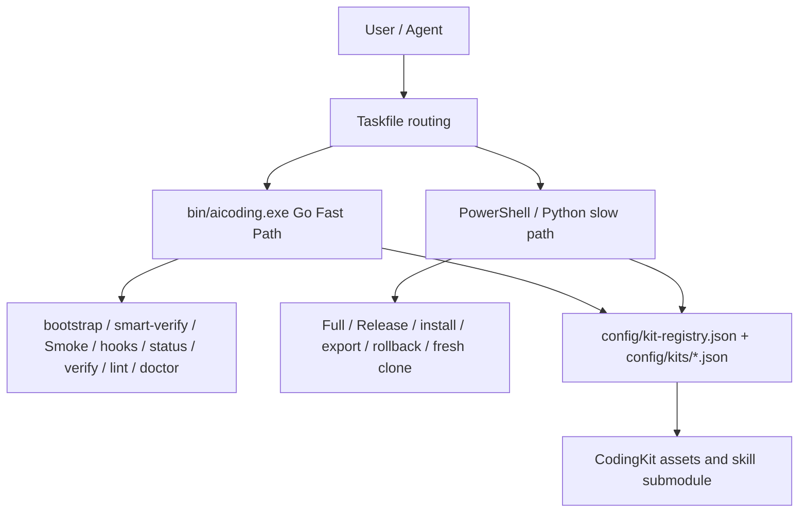

# AiCoding

[](https://github.com/JiaxI2/AiCoding/releases/latest) [](https://go.dev/) [](https://learn.microsoft.com/powershell/) [](https://www.python.org/) [](https://taskfile.dev/) [](LICENSE)

AiCoding is the platform integration, installation, governance, and CodingKit asset repository for the local AI coding workflow. It owns kit registration, hooks, verification entrypoints, release governance, and the Go Fast Path. It does not own embedded skill source code.

[中文](README_CN.md) | [English](README_EN.md)

## Project Positioning / 项目定位

- Platform repository: integrates CodingKit assets, kit registry, local hooks, Taskfile routing, release governance, and Go Fast Path checks.
- Source boundary: authoritative skill/plugin source lives in the `CodingKit/agents/skills` submodule and generated package assets.
- Runtime boundary: installed plugin/runtime state is managed through install, update, and verify workflows, not direct Codex cache edits.
- Release boundary: platform, kit/component, and milestone tags use separate namespaces.

## Current Architecture / 当前架构

AiCoding has two local execution lanes:

- Go Fast Path V2: high-frequency bootstrap, smart-verify, Smoke, hooks, status, repo text, release-note checks, tag/release structural checks, governance lint, pwsh-budget, and doctor perf checks.
- PowerShell/Python slow path: Full/Release, install/uninstall/export, fresh clone, rollback, package, and compatibility workflows.

The Go lane reduces repeated PowerShell cold starts and emits stable JSON. It does not replace Full/Release gates.

## Environment Preview / 环境预览

| Area | Current default | Details |
|---|---|---|
| Human entry | `task setup`, `task smoke`, `workflow smart-verify` | [docs/COMMANDS.md](docs/COMMANDS.md) |
| Go CLI | `bin/aicoding.exe bootstrap/workflow/cache/tag/release` | [docs/FAST_PATH_COMMANDS.md](docs/FAST_PATH_COMMANDS.md) |
| Full/Release | PowerShell/Python scripts | [docs/POWERSHELL_MIGRATION.md](docs/POWERSHELL_MIGRATION.md) |
| Kit model | registry + manifests | [config/kit-registry.json](config/kit-registry.json) |
| Release governance | tag namespace policy | [docs/TAGGING_POLICY.md](docs/TAGGING_POLICY.md) |

## Environment URLs / 环境 URL

| Target | URL |
|---|---|
| Repository | https://github.com/JiaxI2/AiCoding |
| Latest release | https://github.com/JiaxI2/AiCoding/releases/latest |
| Releases | https://github.com/JiaxI2/AiCoding/releases |
| Tags | https://github.com/JiaxI2/AiCoding/tags |
| Changelog | [CHANGELOG.md](CHANGELOG.md) |
| CodingKit | [CodingKit/README.md](CodingKit/README.md) |

## Language Switch / 中英文切换

- Chinese entry: [README_CN.md](README_CN.md)
- English entry: [README_EN.md](README_EN.md)
- Bilingual short entry: [README.md](README.md)

## Quick Start / 快速开始

```powershell
go run ./cmd/aicoding bootstrap --json
bin\aicoding.exe workflow smart-verify --json
task smoke
bin\aicoding.exe doctor pwsh-budget --json
bin\aicoding.exe tag audit --json
bin\aicoding.exe release verify --json
```

Run `task full` or `task release` only when complete local validation or a formal release gate is required.

## Architecture Diagram / 当前架构图



## Documentation Index / 重要文档索引

| Need | Document |
|---|---|
| Architecture overview | [docs/ARCHITECTURE_OVERVIEW.md](docs/ARCHITECTURE_OVERVIEW.md) |
| Fast Path commands | [docs/FAST_PATH_COMMANDS.md](docs/FAST_PATH_COMMANDS.md) |
| Full command matrix | [docs/COMMANDS.md](docs/COMMANDS.md) |
| PowerShell migration map | [docs/POWERSHELL_MIGRATION.md](docs/POWERSHELL_MIGRATION.md) |
| Release governance overlay | [docs/RELEASE_GOVERNANCE_OVERLAY.md](docs/RELEASE_GOVERNANCE_OVERLAY.md) |
| Tag policy | [docs/TAGGING_POLICY.md](docs/TAGGING_POLICY.md) |
| Release policy | [docs/RELEASE_POLICY.md](docs/RELEASE_POLICY.md) |
| Fast Path architecture v1 (historical) | [docs/AICODING_FAST_PATH_ARCHITECTURE_V1.md](docs/AICODING_FAST_PATH_ARCHITECTURE_V1.md) |

## Git Governance Standard / Git 治理标准

Commit type taxonomy: `feat`, `fix`, `docs`, `style`, `refactor`, `perf`, `test`, `build`, `ci`, `chore`.

Branch naming and environment mapping: `main` is the platform baseline; `develop`, `feature/*`, `test/*`, `release/*`, and `hotfix/*` describe integration, feature, test, release, and hotfix work.

Release notes must be typed by primary change type, and platform Tag/Release notes default to Chinese-first bilingual text.
## Release / Tag Short Rules / Release / Tag 简短规则

- Platform release tags: `vMAJOR.MINOR.PATCH`, for example `v0.2.0`.
- Kit/component release tags: `kit/<kit-id>/vMAJOR.MINOR.PATCH`.
- Milestone tags: `milestone/YYYY.MM.DD-<name>`.
- Do not publish component versions as pseudo platform tags such as `v1.3.0-powershell-skill-kit`.
- Do not move, overwrite, or reuse immutable release-bound tags.
