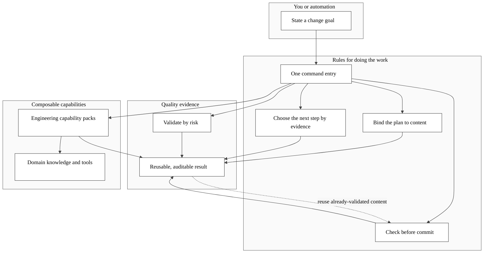

<p align="center">
  
  
</p>

<p align="center"><a href="README.md">Repository home</a> · <a href="README_CN.md">简体中文</a></p>

[](https://github.com/JiaxI2/AiCoding/releases/latest) [](https://github.com/JiaxI2/AiCoding/actions/workflows/aicoding-ci.yml) [](LICENSE) [](https://go.dev/doc/go1.22) [](https://go.dev/doc/devel/release#go1.26.5) [](https://github.com/dominikh/go-tools/releases/tag/2026.1) [](https://go.googlesource.com/vuln/+/refs/tags/v1.6.0) [](https://github.com/PowerShell/PowerShell/releases/tag/v7.0.0) [](https://docs.python.org/3.10/whatsnew/3.10.html) [](https://taskfile.dev/) [](https://github.com/llvm/llvm-project/releases/tag/llvmorg-17.0.2) [](docs/guides/C99_STANDARD_C_SKILL.md)

AiCoding turns local AI coding work into something verifiable, reusable, and auditable: a full check of one Git content state takes about 150 seconds, while an unchanged state can be rechecked in about 424 milliseconds, with every green result traceable to what it validated.

## Status

The product is Windows-first and automation-ready, and every formal entrypoint returns JSON. [CI](https://github.com/JiaxI2/AiCoding/actions/workflows/aicoding-ci.yml) continuously validates the main line; [CHANGELOG](CHANGELOG.md) and [Releases](https://github.com/JiaxI2/AiCoding/releases) record deliverable changes.

## The loop at a glance



## Quick Start

From the root of a clean clone that includes submodules, copy these three PowerShell lines in order:

```powershell
go run ./cmd/aicoding bootstrap --json && .\bin\aicoding.exe provision --json
.\bin\aicoding.exe verify --profile Smoke --json
.\bin\aicoding.exe test --profile Smoke --json
```

The first line builds the untracked local binary from source and provisions the repository. You should then see `ok: true`; the final test summary should contain `conclusion: PASS` and `fail: 0`. If any step fails, run `.\bin\aicoding.exe doctor --all --json` first, then use the [command matrix](docs/COMMANDS.md) to follow the reported category.

## Roadmap

See the [architecture roadmap](docs/architecture/07-roadmap.md) for direction. The live roadmap is machine-queryable with `.\bin\aicoding.exe todolist --json`, so people and agents read the same queue.

## Choose your route

| Who are you? | What do you need? | Start here |
|---|---|---|
| New user | Reach the first green result and keep exploring | The three lines above → [command matrix](docs/COMMANDS.md) |
| Agent / automation | Stable commands and JSON result contracts | [Command matrix](docs/COMMANDS.md) → [report schema](docs/operations/testing/REPORT_SCHEMA.md) |
| Contributor | Change code without crossing architecture boundaries | [Required architecture path](docs/architecture/README.md) → [contributing guide](CONTRIBUTING.md) |
| Kit author | Understand lifecycle and track the generate-valid-by-default entry | [Kit lifecycle](docs/architecture/KIT_LIFECYCLE_ARCHITECTURE.md) → planned [`kit init`](docs/todolist/0010-kit-init-scaffold.md) |

## Core and Kits

The frozen six-module core provides a stable base, content-addressed evidence binds conclusions to Git content, and the adjudicative loop decides only the next step instead of creating another executor. Their contracts live in the [core architecture](docs/architecture/AICODING_CORE_ARCHITECTURE.md), [validation evidence ADR](docs/decisions/0007-validation-evidence.md), and [loop architecture](docs/architecture/LOOP_ENGINEERING_ARCHITECTURE.md).

This table is the exact enabled set from `config/kit-registry.json`. Each capability sentence comes from its manifest, with one detail link per row.

| Kit | Core capability | Details |
|---|---|---|
| `aicoding-platform` | AiCoding platform integration, Codex plugin marketplace registration, CodingKit asset discovery, and submodule validation. | [Kit / Plugin view](docs/reference/KIT_PLUGIN_VIEW.md) |
| `docsync-plus` | Semantic documentation drift detection kit for AiCoding repositories. | [DocSync Plus](docs/architecture/DOC_SYNC_PLUS_SPEC.md) |
| `reuse-governance` | Declarative governance for independently integrated reusable modules. | [Reuse governance](docs/operations/THIRD_PARTY_REUSE_GOVERNANCE.md) |
| `common-control-kit` | Reusable C99 control modules under CodingKit/modules/common/controller. | [Control modules](CodingKit/modules/common/controller/foc/README.md) |
| `c-userstyle-kit` | First-party C99 style, comment, lint, host-compile, and behavior verification assets backed by the Huawei DKBA 2826-2011&#46;5 reference. | [C UserStyle Kit](docs/guides/C99_STANDARD_C_SKILL.md) |
| `release-governance-overlay-kit` | Tag/release namespace governance, Taskfile entry, and performance-loop overlay for AiCoding. | [Release governance](docs/governance/RELEASE_GOVERNANCE_OVERLAY.md) |

## Why this repository compounds

- **Foundation compounds:** the frozen core accepts composition above it, so new capability does not demolish old boundaries ([vision and four quadrants](docs/architecture/00-vision.md)).
- **Evidence compounds:** validate a content state once, then reuse it across worktrees in about 424 milliseconds ([measured baseline](docs/operations/VALIDATION_EVIDENCE_BUDGET.md)).
- **Capability compounds:** loop, plan, validation evidence, and Kit lifecycle share existing Primitives instead of creating parallel authorities ([Primitive Constitution](docs/architecture/PRIMITIVE_CONSTITUTION.md)).
- **Knowledge compounds:** every uncertainty quadrant has a durable home whose output becomes input to the next task ([vision §3](docs/architecture/00-vision.md)).

## Current Architecture

The `Go CLI` is the only formal product entrypoint: `lifecycle` manages capabilities, `doctor --all` / `verify --profile` / `test --profile` produce tiered conclusions, and `release verify|gate` protects delivery. Taskfile remains a short router; PowerShell and Python remain specialty boundaries. Follow the [architecture reading path](docs/architecture/README.md) for the complete layering.

## Git Workflow

The repository follows its [Git Governance Standard](docs/governance/RELEASE_POLICY.md): commit types are `feat`, `fix`, `docs`, `style`, `refactor`, `perf`, `test`, `build`, `ci`, `chore`; branch mappings are `main`, `develop`, `feature`, `test`, `release`, `hotfix`; Release typed notes are grouped by primary type and checked by the [release-note gate](.github/RELEASE_TEMPLATE.md).

## Repository Navigation

| Need | Authoritative entry |
|---|---|
| Understand the architecture | [Architecture reading path](docs/architecture/README.md) |
| Find a command | [Command matrix](docs/COMMANDS.md) |
| Read validation standards | [Global test plan](docs/operations/testing/GLOBAL_TEST_PLAN.md) |
| Contribute | [Contributing guide](CONTRIBUTING.md) |
| Report a problem | [Issues](https://github.com/JiaxI2/AiCoding/issues) |
| Report a vulnerability | [Security](SECURITY.md) |

## Star History

<a href="https://www.star-history.com/?repos=JiaxI2%2FAiCoding&type=date&legend=top-left">
  <picture>
    <source media="(prefers-color-scheme: dark)" srcset="https://api.star-history.com/chart?repos=JiaxI2/AiCoding&type=date&theme=dark&legend=top-left&sealed_token=cYCLcUDDC2taPIy56cwbcdHM07uJjknjW64NTV1pCAihGJ6Jv2QLIrDj6blxI9_Qt6JYOqA9ciwwXXBE45GT1kOhpPg7ghDjl1b7Bn3-IqEdrgKJwMoc1MG65gcK_coW2NAH_B2neEPyiVzsTfwM7psU6QzMzmSuhrvQbY9fvDgPr3T0DT5KA3QLh8Dd">
    <source media="(prefers-color-scheme: light)" srcset="https://api.star-history.com/chart?repos=JiaxI2/AiCoding&type=date&legend=top-left&sealed_token=cYCLcUDDC2taPIy56cwbcdHM07uJjknjW64NTV1pCAihGJ6Jv2QLIrDj6blxI9_Qt6JYOqA9ciwwXXBE45GT1kOhpPg7ghDjl1b7Bn3-IqEdrgKJwMoc1MG65gcK_coW2NAH_B2neEPyiVzsTfwM7psU6QzMzmSuhrvQbY9fvDgPr3T0DT5KA3QLh8Dd">
    
  </picture>
</a>
