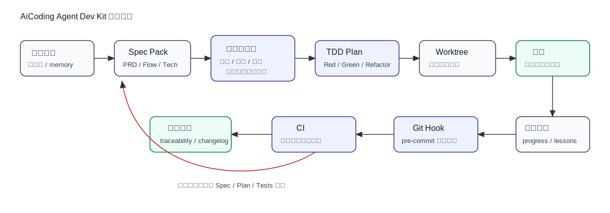
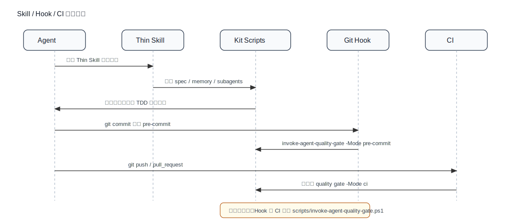

# AiCoding Agent Dev Kit Execution Model

## 1. Kit 执行逻辑总图



```text
会话开始
  -> 读取 AGENTS.md / Agent Runtime 规则
  -> 读取 progress.txt / lessons.md
  -> Spec Pack 审查
  -> 三道门：需求审查 / 设计审查 / 任务分解审查
  -> IMPLEMENTATION_PLAN.md 强制 TDD
  -> 可选 worktree 并行
  -> Red / Green / Refactor
  -> 更新 memory / traceability
  -> Hook
  -> CI
```

## 2. Skill / Hook / CI 触发时序



```text
Thin Skill：
  只负责引导 Agent 读取 spec/memory、选择 subagent、调用质量门禁。

Git Hook：
  本地提交前快速失败，调用 scripts/invoke-agent-quality-gate.ps1 -Mode pre-commit。

CI：
  远程 push / pull_request 后兜底，调用同一个质量门禁脚本 -Mode ci。

CLI：
  负责安装、分发、状态检查、验证、测试、卸载。
```

## 3. 三道审查门

```text
需求门 Requirement Review：
  PRD / APP_FLOW 完整，目标、边界、验收标准明确。

设计门 Design Review：
  TECH_STACK / PROJECT_STRUCTURE / ADR 完整，关键架构选择有记录。

任务门 Task & TDD Plan Review：
  IMPLEMENTATION_PLAN 每个 Task 必须包含 Red-Green-Refactor 步骤。
```

## 4. Subagent 使用建议

Skill 在长上下文里可能漂移，subagent 更适合承载稳定职责：

```text
spec-reviewer          -> 审查 Spec Pack 是否完整
implementation-planner -> 生成带 TDD 的任务计划
tdd-enforcer           -> 审查 Plan 是否强制 TDD
worktree-coordinator   -> 管理并行 worktree
systematic-debugger    -> 接收明确日志后做系统调试
```

## 5. Superpowers 策略

Superpowers 可以作为本地加速器，但不能进入 CI 硬依赖。

```text
Superpowers available:
  Agent 可使用 brainstorming / writing-plans / test-driven-development / systematic-debugging。

Superpowers unavailable:
  回退到本 Kit 的 spec 模板、subagent 模板和 validate 脚本。

CI:
  只运行 Kit 自己的脚本。
```
