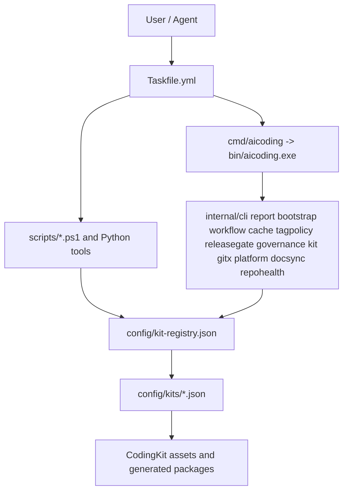

# Architecture Overview

This document keeps the architecture details that no longer belong in the short README entry pages.

## Repository Role

AiCoding is the platform repository around the local AI coding workflow. It owns integration and governance surfaces:

- kit registry and kit manifests;
- local hook wrappers;
- Taskfile command routing;
- Go Fast Path CLI integration;
- PowerShell/Python slow-path orchestration;
- release and tag governance documentation;
- CodingKit platform assets outside the installed plugin cache.

AiCoding does not own embedded skill source code. The authoritative skill/plugin source is the `CodingKit/agents/skills` submodule and its generated package assets.

## Layer Model

## Go Fast Path V2

The Go Fast Path is for high-frequency local checks that should avoid repeated PowerShell startup. V2 adds a minimal closed loop:

- `bootstrap`: validates repo root, `go.mod`, `.git`, Git, Go, `bin/`, and builds `bin/aicoding.exe`;
- `workflow smart-verify`: reads Git staged/changed/untracked files, emits a plan, and runs selected Go quick checks;
- `cache status/clean`: reports and clears `.aicoding/cache/fast-path-v2` without affecting pass/fail;
- `doctor pwsh-budget`: classifies PowerShell invocation points as hot path, slow path, fallback, or documentation-only;
- `tag audit`: classifies local tags by namespace and reports legacy tags as warnings;
- `release verify`: performs structural release/template/tag-policy checks without replacing Release gates.

Existing Go fast checks remain:

- kit Smoke manifest verification;
- governance lint;
- hook preference checks;
- repository text checks;
- release-note and overlay file presence checks;
- repository status summary;
- PowerShell invocation inventory;
- performance probes.

The Go layer is intentionally local and structural. It does not replace Full/Release semantic gates.

## PowerShell/Python Slow Path

PowerShell and Python remain the owner for workflows that need complete orchestration, packaging, installer behavior, compatibility gates, or release validation:

- install, update, uninstall, rollback;
- Full and Release profiles;
- export/package paths;
- fresh clone validation;
- kit-specific install/status/test/verify scripts;
- tag correction plans and release-governance overlay compatibility checks;
- PowerShell AST, PSScriptAnalyzer, and compatibility gates;
- hardware-related fixtures and future debug backends.

No `scripts/*.ps1` file is removed or migrated to `legacy/` by Fast Path V2.

## Registry And Manifest Contract

`config/kit-registry.json` lists enabled kits and points to `config/kits/*.json`. Manifests describe required paths, command surfaces, package outputs, runtime state, and release metadata. The Go Fast Path reads this structure; it does not replace manifest ownership.

## Runtime Boundary

The installed plugin and Codex runtime state are not edited directly. Install/update workflows preserve enabled state, validate package drift, refresh through supported Marketplace paths, and keep the submodule clean.

## Command Boundary

All new Go commands support `--json` and use stable process outcomes: `0` for `ok=true`, `1` for structural or execution failure, and `2` for usage errors. JSON output stays under the common `report.Result` envelope so automation can parse command, repo root, data, errors, and elapsed time consistently.

## Documentation Map

- Short entry: `README.md`, `README_CN.md`, `README_EN.md`
- Command matrix: `docs/COMMANDS.md`
- Fast Path commands: `docs/FAST_PATH_COMMANDS.md`
- PowerShell migration map: `docs/POWERSHELL_MIGRATION.md`
- Release governance: `docs/RELEASE_GOVERNANCE_OVERLAY.md`
- Tag rules: `docs/TAGGING_POLICY.md`