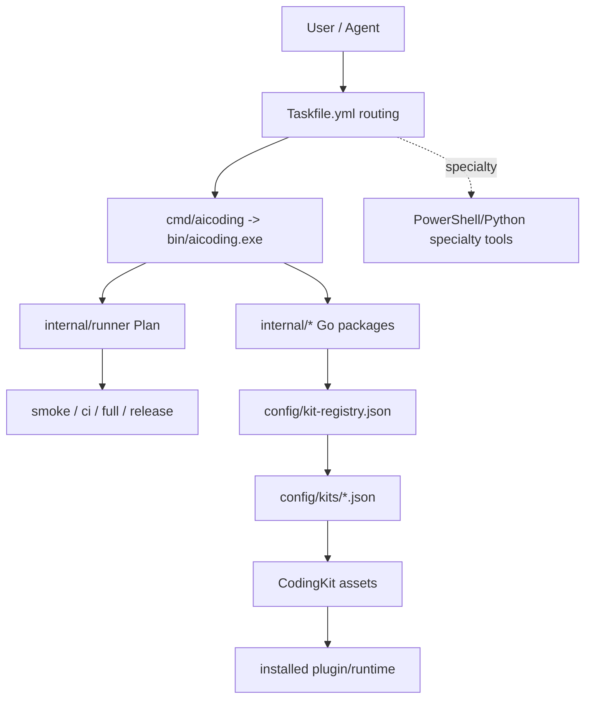

# Architecture Overview

## Repository Role

AiCoding 是本地 AI coding 工作流的平台仓库。它拥有 kit registry、kit manifest、本地 hook、Taskfile 路由、Go CLI 控制面、发布治理文档和 CodingKit 平台资产。

AiCoding 不拥有嵌入式 skill 源码。权威 skill/plugin 源位于 `CodingKit/agents/skills` 子模块及其生成包资产。

## Layer Model

## Go CLI Control Plane

Go CLI 是默认控制面，提供稳定 `report.Result` JSON。当前默认入口包括：

- `bootstrap`；
- `smoke`；
- `ci --profile Smoke`；
- `hook pre-commit` 和 `hook commit-msg`；
- `status --all`；
- `governance lint`；
- `verify hooks|repo-text|release-notes`；
- `doctor perf|pwsh|pwsh-budget`；
- `skill c99-standard-c status|templates|fmt|check`；
- `docsync staged|all|ci|release`；
- `skill verify --all --profile Smoke|Full|Release`；
- `lifecycle plan|install|update|uninstall|rollback`；
- `export --all --zip`；
- `fresh-clone --profile Smoke|Full|Release`；
- `full --json`；
- `release verify` 和 `release gate`。

## Concurrent Plan Boundary

`internal/runner` 提供可组合并发 Plan。只读检查通过任务 ID 注册到 Plan 中，有界并发执行并保持输出顺序。需要新增、替换或移除检查点时，修改 Plan 注册即可，不改调度器。

写状态、写 ZIP、安装/卸载等有副作用路径保持在对应 Go 包中串行执行。

## Manifest Contract

Kit manifest 使用当前分类：

- `mode`: `go-builtin`, `external-cli`, `powershell-specialty`, `declarative`。
- `type`: `builtin-check`, `builtin-lifecycle`, `builtin-package`, `external-command`, `go-composed`, `specialty-pwsh`, `unsupported`。

## PowerShell/Python Boundary

PowerShell/Python 只保留在专项边界：tag planning / overlay compatibility、PowerShell 质量、安全、Plan Mode、外部 skill 和硬件/工具链专项流程。它们不是默认 Full、Release、lifecycle、export、fresh-clone、DocSync 或 skill verify 控制面。