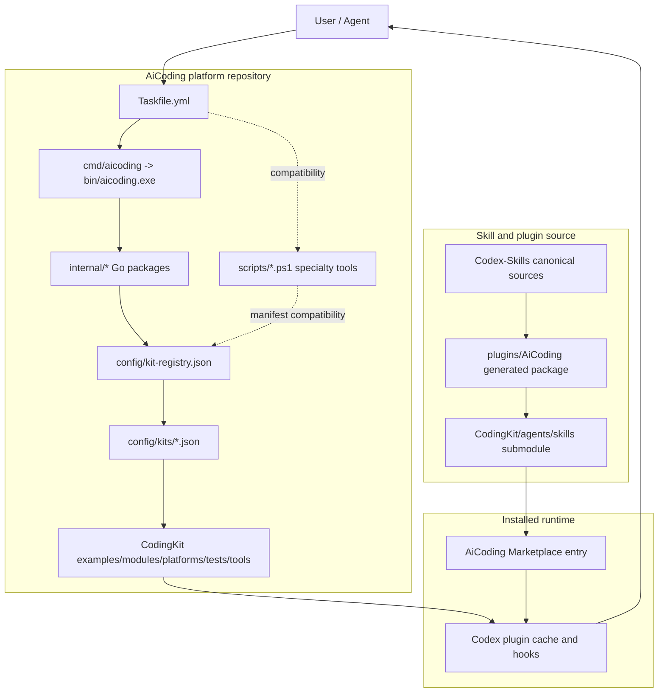

# Architecture Overview

This document keeps architecture details that do not belong in the short README entry pages.

## Repository Role

AiCoding is the platform repository around the local AI coding workflow. It owns integration and governance surfaces:

- kit registry and kit manifests;
- local hook wrappers;
- Taskfile command routing;
- Go CLI control-plane integration;
- PowerShell/Python compatibility and specialty tooling;
- release and tag governance documentation;
- CodingKit platform assets outside the installed plugin cache.

AiCoding does not own embedded skill source code. The authoritative skill/plugin source is the `CodingKit/agents/skills` submodule and its generated package assets.

## Layer Model

## Go CLI Control Plane

The Go CLI is the default control plane for local checks, CI smoke, and release gates. It provides stable JSON through the common `report.Result` envelope and owns these default entrypoints:

- `bootstrap`;
- `workflow smart-verify`;
- `hook pre-commit` and `hook commit-msg`;
- `status --all`;
- `governance lint`;
- `verify hooks`, `verify repo-text`, and `verify release-notes`;
- `doctor perf`, `doctor pwsh`, and `doctor pwsh-budget`;
- `cstyle status|templates|fmt|check`;
- `docsync staged|all|ci|release`;
- `skill verify --all --profile Smoke|Full|Release`;
- `lifecycle plan|install|update|uninstall|rollback`;
- `export --all --zip`;
- `fresh-clone --profile Smoke|Full|Release`;
- `full --json`;
- `release verify` and `release gate`.

Full and Release gates are Go-native aggregate gates. They verify registry and manifest structure, enabled kit consistency, lifecycle plans, skill structure, DocSync, export, release notes, hooks, repo text, and fresh-clone behavior according to profile.

## PowerShell/Python Compatibility Boundary

PowerShell and Python remain only where they are the right tool or compatibility surface:

- tag correction planning and release-governance overlay compatibility;
- PowerShell AST, PSScriptAnalyzer, regex, and PowerShell-specific quality checks;
- external third-party skill install/audit workflows;
- Plan Mode and agent helper scripts;
- safety-specific tooling;
- hardware/toolchain-specific diagnostics such as DSS/XDS/flash-related flows;
- manifest-declared compatibility commands that have not been migrated and are not default routes.

PowerShell is not the default owner for Full, Release gate, lifecycle, export, fresh-clone, DocSync, or skill verification.

## Registry And Manifest Contract

`config/kit-registry.json` lists enabled kits and points to `config/kits/*.json`. Manifests describe required paths, command surfaces, package outputs, runtime state, and release metadata. The Go CLI reads this structure and validates command envelopes without copying CodingKit assets into the plugin.

## Runtime Boundary

The installed plugin and Codex runtime state are not edited directly. Install/update workflows preserve enabled state, validate package drift, refresh through supported Marketplace paths, and keep the submodule clean.

## Command Boundary

All new Go commands support `--json` and use stable process outcomes: `0` for `ok=true`, `1` for structural or execution failure, and `2` for usage errors. JSON output stays under the common `report.Result` envelope so automation can parse command, repo root, data, errors, and elapsed time consistently.

Taskfile remains routing only. Business logic belongs in Go packages under `internal/*`; retained scripts are compatibility or specialty tools.

## Documentation Map

- Short entry: `README.md`, `README_CN.md`, `README_EN.md`
- Command matrix: `docs/COMMANDS.md`
- Fast Path commands: `docs/FAST_PATH_COMMANDS.md`
- PowerShell migration map: `docs/POWERSHELL_MIGRATION.md`
- Release governance: `docs/RELEASE_GOVERNANCE_OVERLAY.md`
- Tag rules: `docs/TAGGING_POLICY.md`
