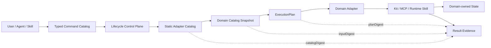

# AiCoding 正交内核与扩展架构

Status: Accepted and Frozen

## 1. 结论

AiCoding 采用“正交深模块（orthogonal deep modules）+ 仓库控制面 + 静态扩展适配器”架构。

它不是一个不断吸收职责的微内核，也不是一组由 Agent 临时拼接的脚本。稳定基础由六个
互不拥有对方职责的模块组成：

```text
snapshot = 事实身份
plan     = 目标意图
runner   = 执行调度
adapter  = 领域翻译
report   = 可验证证据
state    = 领域所有
```

Kit、MCP、runtime Skill 等功能在这些基础上扩展。新增或更新功能通常只增加或修改领域
manifest、领域实现和契约测试，不扩大内核权力。架构阶段在本文定义的闭环与冻结条件满足后
结束；后续工作默认是功能扩展或模块内部优化，不再被称为“继续升级架构”。

实现目录、文件名、包名、模块名、服务名和稳定 ID 不编码版本。版本只出现在 manifest
元数据、README、CHANGELOG、Tag、Release 或其他说明文档中。

## 2. 设计来源与对抗性结论

本架构综合了以下证据：

- Git 的内容寻址对象、Merkle DAG、轻量 refs、index 候选状态、对象传输和安全 ref 更新；
- GitHub Actions 的可复用工作流与权限递减，以及 GitHub App 的细粒度、短期凭据边界；
- mattpocock/skills 的小型、可组合 Skill，以及 source copy 与 managed plugin 两种分发语义；
- `Orthogonal_Architecture_Design_Kit` 的 God Core 禁令、状态所有权和局部验证原则；
- 用户 Git MOC 与 12 个索引，尤其“稳定边界优先于无限优化”的停止规则。

参考资料：

- [Git plumbing 与 porcelain](https://git-scm.com/book/en/v2/Git-Internals-Plumbing-and-Porcelain)
- [Git 安全更新 refs](https://git-scm.com/docs/git-update-ref)
- [Git protocol v2](https://git-scm.com/docs/protocol-v2)
- [Git packfiles](https://git-scm.com/book/en/v2/Git-Internals-Packfiles.html)
- [GitHub 可复用工作流](https://docs.github.com/en/actions/reference/workflows-and-actions/reusing-workflow-configurations)
- [GitHub Actions 的 GITHUB_TOKEN](https://docs.github.com/en/actions/concepts/security/github_token)
- [mattpocock/skills](https://github.com/mattpocock/skills)

关键结论不是“复制 Git”，而是保留其边界思想：

1. 身份与名称分离：digest 标识不可变事实，profile/selection 是可移动引用。
2. 事实与视图分离：catalog 是事实输入，list/status/report 是可重建视图。
3. 候选状态与发布分离：plan 描述意图，apply 才修改领域状态。
4. 逻辑模型与物理优化分离：先固定语义，再由测量决定缓存、并发或原生加速。
5. 乐观并发与所有权明确：写操作只能修改登记资产，不能以全局清理代替 rollback。
6. 架构必须知道何时停止：没有第二个真实消费者和稳定变化点，不抽象。

## 3. 闭环



一次正式生命周期调用完成以下闭环：

1. Typed Command Catalog 把用户或 Agent 的命令解析为稳定 action 与参数。
2. Static Adapter Catalog 选择 Kit、MCP 或 runtime Skill adapter，并声明 action 的
   `read`/`write` effect、输入种类、entrypoint 与状态所有者。
3. Kit/MCP 将 registry 和其引用的 manifest 组合为内容树快照；runtime Skill 将平台配置
   与可用的 source commit 组合为输入快照。
4. Lifecycle 生成 `ExecutionPlan`；摘要只包含稳定意图，不包含函数地址和 repo 绝对路径。
5. Runner 只按 plan 调度，不做领域判断；当前跨 adapter 顺序执行，避免并行写状态。
6. Adapter 只把统一 action 翻译给领域模块；安装、同步、验证和状态规则仍由领域拥有。
7. JSON 结果同时携带 adapter catalog、输入与 plan digest，调用者可确认“对什么事实执行了
   什么意图”。领域 state、backup 或 rollback 证据继续由对应领域返回。

这条链路已经有真实消费者：

- `ExecutionPlan`：pre-commit 与 lifecycle；
- 内容树快照：Kit 与 MCP；
- lifecycle adapter：Kit、MCP 与 runtime Skill；
- JSON digest 证据：正式 lifecycle、Kit list 和 MCP list/领域命令。

## 4. 正交模块契约

| 模块 | 唯一职责 | 输入/输出 | 禁止承担 | 权威实现 |
|---|---|---|---|---|
| root/path | repo root、规范路径、越界拒绝 | path value | 领域发现、生命周期策略 | `internal/platform` |
| snapshot | 规范化事实、内容树、digest、只读 decode | value -> snapshot | action 选择、I/O 执行 | `internal/registry` |
| plan | 确定性意图、选择、snapshot、digest | task descriptors | 外部资源操作、领域判断 | `internal/runner.ExecutionPlan` |
| runner | timeout、cancel、有界并发、稳定结果顺序 | plan -> task results | lifecycle 策略、状态所有权 | `internal/runner` |
| adapter catalog | 静态领域翻译登记与 effect 声明 | action + selection | manifest 业务规则、全局状态 | `internal/lifecycle` |
| domain | Kit/MCP/runtime Skill 的业务与状态规则 | typed domain values | 改写其他领域状态 | `internal/kit`、`internal/mcpcontrol`、受控 specialty |
| report | envelope、证据、错误分类、JSON contract | results -> evidence | 调度、领域修复 | `internal/report` |
| command catalog | command ID、alias、handler、help | argv -> command | 领域生命周期实现 | `internal/cli` |

允许的连接方式是不可变值对象、descriptor、snapshot 和 result。禁止：

- snapshot 调用 runner 或领域逻辑；
- runner 识别 Kit、MCP、Skill 等领域身份；
- adapter 保存所有领域状态或重写领域策略；
- report 触发修复；
- 任一 `Core`、`Manager` 或全局 registry 聚合全部状态与流程。

模块可以单独优化。例如 snapshot 的规范化、runner 的调度算法或 report 的序列化可以在
保持公开契约时独立替换，不要求重构其他模块。

## 5. 仓库控制面与 Agent 边界

生命周期由 AiCoding 仓库拥有更合适，原因是仓库拥有 registry、manifest、Marketplace
绑定、安装状态、治理规则与验证入口；Agent 只拥有一次会话中的用户意图。若让 Agent
自己实现安装/更新/卸载，每种 Agent 都会复制状态判断、权限与 rollback 逻辑。

正式边界是：

```text
Agent / Skill
  -> execute bin/aicoding.exe ... --json
     -> validate report.Result
        -> inspect inputDigest / planDigest / data
```

Agent 不导入 `internal/*` Go 包，不直接修改 plugin cache、Codex 配置或 runtime junction。
Skill 可以编排多条正式命令，但不能实现第二 lifecycle。MCP server 只暴露领域工具和资源，
不注册 AiCoding 安装/更新工作流；若将来出现第二个独立、真实的远程控制客户端，再基于同一
命令契约评估服务 API，而不是预建 HTTP/gRPC/MCP 控制面。

详见 [CLI 与 MCP 控制面](CLI_MCP_CONTROL_PLANE.md)。

## 6. 外部 Skill 与 MCP 的生命周期

### 6.1 Skill

Skill 状态必须区分：

```text
upstream source pin
-> released plugin package / standalone source path
-> installed plugin or junction
-> runtime discovery
```

- 外部 GitHub Skill 先进入 Codex-Skills 的 declared nested submodule 与 binding registry；
- AiCoding 只登记 released source path、profile 和 runtime exposure；
- `install`/`update`/`uninstall` 通过 `runtime-skill` adapter 调用受控 profile 实现；
- AiCoding plugin 的 install/update 归 Kit adapter 所有；
- source pin 更新是跨仓库维护，不等同于 runtime update；
- 同名 Skill 只能有一个 active runtime source。

### 6.2 MCP

- `config/mcp-registry.json` 是组件引用目录；component manifest 是组件事实；
- `install`/`update` 管理组件 runtime、package、Codex managed block 和 install state；
- `uninstall` 只删除登记的 managed block、owned runtime 与 state；
- `status`/`doctor`/`verify` 是只读观察；
- MCP server 的 tools/resources 属于 capability，用户工作流属于 Skill。

### 6.3 统一 action 语义

| Action | 语义 | Effect |
|---|---|---|
| `plan` | 为 install/update/uninstall 生成候选意图，不写状态 | read |
| `install` | 从登记事实建立 owned runtime/state | write |
| `update` | 依据相同 identity 收敛 package/runtime/config，不创建新 identity | write |
| `uninstall` | 删除领域明确拥有的 exposure/runtime/state | write |
| `status` | 对比登记事实、运行时和 state | read |
| `doctor` | 诊断环境与漂移 | read |
| `verify` | 执行确定性契约/兼容验证 | read |
| `rollback` | 使用领域证据恢复领域拥有状态；不是全域业务补偿 | write |

“同步”不是新的顶层 action。它是 Kit update 内的 plugin refresh、MCP update 内的配置收敛，
或 runtime Skill update 内的 exposure 收敛；同步失败由领域结果说明，不能由 Core 猜测。

## 7. 状态、事务与并发边界

不存在虚构的全局事务：

- Kit 保存 install state 与 last rollback snapshot；
- MCP 保存 install state，并在单次配置/runtime 操作中使用 backup/staging 恢复；
- runtime Skill specialty 实现保存自身 migration/rollback 证据；
- lifecycle 聚合结果，但不声称三个领域可以原子提交或统一 rollback。

写 action 跨 adapter 顺序执行。只读 action 将来只有在基准证明收益、输出顺序保持且领域
契约声明线程安全时才能并行；该优化属于 runner/control-plane 内部变化，不改变 action。

## 8. 性能与 C 语言边界

Go 单二进制、静态 adapter 与一次 parse/normalize/digest 是当前默认。C 不是“更底层”就
自动更快：跨语言 ABI、内存所有权、Windows 构建与测试矩阵会增加稳定边界成本。

只有同时满足以下条件才允许提议 C/Rust/native module：

1. 可重复 profile 证明热点位于纯计算内核，而不是进程启动、磁盘或网络；
2. Go 优化无法达到已批准预算；
3. 该算法有至少两个真实消费者和小型稳定的 buffer-in/buffer-out ABI；
4. native 与 Go fallback 通过同一 golden/contract tests；
5. 收益覆盖构建、供应链、跨平台和故障诊断成本。

当前 snapshot、JSON、文件与子进程路径不满足这些条件，因此不引入 C 层。此结论不禁止
未来基于证据的局部 native 加速，但禁止让 native module 变成新 Core。

## 9. 验证半径

验证范围由公开契约影响半径决定：

| 变化 | 最小必跑 | 扩大条件 |
|---|---|---|
| snapshot 内部实现 | `internal/registry` contract tests | digest/JSON contract 变化时跑 Kit/MCP consumers |
| Kit manifest/实现 | `internal/kit` + 对应 lifecycle consumer | 公共 action/report 变化时跑 CLI contracts |
| MCP manifest/实现 | `internal/mcpcontrol` + 对应 lifecycle consumer | Codex config/report 变化时跑 CLI contracts |
| runner 内部实现 | `internal/runner` tests | plan/task contract 变化时跑所有 consumers |
| adapter descriptor/selection | `internal/lifecycle` tests | action 或 effect 变化时跑 CLI、Smoke/Full |
| report/schema | `internal/report` + CLI contract | 外部 JSON 变化时跑 Full/Release |
| command catalog | `internal/cli` catalog/contract tests | 正式命令变化时跑 docs/governance/Full |
| release、跨模块契约或依赖治理 | consumer regressions + Full/Release | 始终 |

局部测试是开发反馈，不替代交付门禁。实际 release 仍按仓库规则执行 Marketplace、安装、
refresh、rollback 和 uninstall ownership 验证。

`config/dependency-governance.json` 的 `goPackageBoundaries` 将关键禁令接入现有
`governance dependencies`：registry/runner/report 不得反向依赖 lifecycle 或领域，Kit/MCP
不得互相依赖，领域不得依赖 CLI/repohealth/testengine。它检查 production Go imports，测试
可以引用相邻消费者以完成 contract verification。

## 10. 架构冻结条件

本架构在以下条件全部满足时冻结：

- 六个正交职责及依赖禁令有权威文档；
- registry 与 manifest 已形成内容树快照，且 Kit/MCP 两个消费者复用；
- lifecycle 使用静态 adapter catalog，不再用 scope switch 绑定领域；
- lifecycle 使用 `ExecutionPlan`，报告携带 catalog/input/plan digest；
- Kit、MCP、runtime Skill 的 action、状态所有权和 rollback 边界明确；
- Agent 只通过正式 CLI/JSON 调用，MCP 不反向拥有平台 workflow；
- 模块、消费者与全量验证半径已定义并由测试覆盖。

冻结后的规则：

1. 新 Kit/MCP/Skill 优先增加 manifest/registry entry 与领域测试，不修改六个模块契约。
2. 新领域只有在无法由已有领域表达时才增加静态 adapter；仍不增加中心判断。
3. capability graph、全域 journal、远程控制 API、动态 plugin ABI、native core 均不在基线内。
4. 只有现实问题、稳定变化点和至少两个消费者同时出现，才以 ADR 解冻对应边界。
5. 架构文档记录长期不变量；功能计划、性能实验和迁移任务进入各自 backlog/ADR。

## 11. 明确拒绝

- God Core、全局状态仓库或跨领域 `SystemManager`；
- Go dynamic plugin ABI、任意第三方代码进程内加载；
- 第二 CLI、第二 lifecycle、第二 test engine、第二 report authority；
- 让 runner 做领域决策、让 adapter 承载业务策略、让 report 触发修复；
- 把 source pin、package、installed state 和 runtime discovery 折叠为一个布尔值；
- 默认每次局部修改都跑全量回归，或反过来用局部测试声称 release 完成；
- 为推测中的未来能力预建 capability graph、全域事务或服务 API；
- 在实现 identity 中编码版本，或用平行目录表达架构演进。
