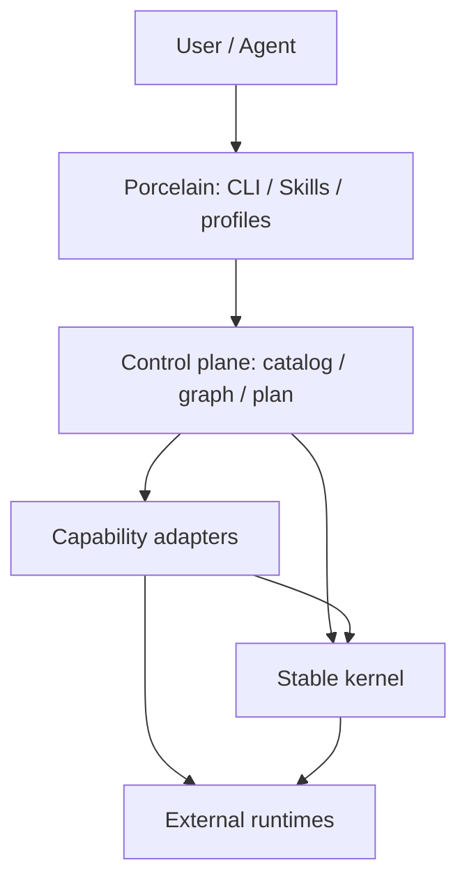

# AiCoding 内核与扩展图架构

Status: Accepted

## 1. 架构结论

AiCoding 采用“稳定内核（plumbing）+ 扩展图（extension graph）+ 用户工作流（porcelain）”架构。

内核只负责跨领域、可证明稳定的基础能力；Kit、MCP、runtime Skill、治理规则、
测试 profile 和专项工具全部通过声明式能力与静态 adapter 组合。用户可玩功能建立在
同一组基础能力上，不再各自实现路径解析、registry 加载、执行调度、报告或回滚。

实现目录、文件名、包名、模块名、服务名和稳定 ID 不编码版本。版本只允许出现在
README、CHANGELOG、Release、manifest 元数据和其他说明文档中。架构演进通过兼容
契约、ADR 和迁移记录表达，不创建平行的“新版内核”。

## 2. 为什么这样定

Git 的可扩展性来自少量可靠 plumbing、内容寻址对象、可移动 refs 和清晰的
porcelain 边界；协议通过 capability negotiation 扩展，而不是让基础对象理解所有
上层工作流。GitHub 在此基础上把仓库内事件自动化交给 Actions，把长期、跨仓库集成
交给权限更细且使用短期令牌的 GitHub Apps。mattpocock/skills 则把 Skill 保持为
小型、可组合资产，区分用户调用与模型调用，并用领域文档和 ADR 控制扩展边界。

AiCoding 当前已经具备正确方向：单 Go CLI、静态 lifecycle adapter、唯一测试引擎、
统一报告和有界并发 runner。需要优化的不是再造一个框架，而是把这些深模块提升为
所有扩展共用的稳定基础，并消除命令、路径、registry 和报告的重复真相。

参考：

- [Git plumbing 与 porcelain](https://git-scm.com/book/en/v2/Git-Internals-Plumbing-and-Porcelain)
- [Git protocol capability negotiation](https://git-scm.com/docs/protocol-v2)
- [Git packfiles](https://git-scm.com/book/en/v2/Git-Internals-Packfiles.html)
- [GitHub reusable workflows](https://docs.github.com/en/actions/concepts/workflows-and-actions/reusing-workflow-configurations)
- [GitHub Apps 与 Actions 的边界](https://docs.github.com/en/apps/creating-github-apps/about-creating-github-apps/deciding-when-to-build-a-github-app)
- [mattpocock/skills](https://github.com/mattpocock/skills)

## 3. 总体结构



与现有语义层一一对应：

| 语义层 | 架构职责 | 主要资产 |
|---|---|---|
| platform | 用户意图与 porcelain | `cmd/aicoding`、`internal/cli`、Taskfile、平台 Skills、CI |
| integration | 组合与控制面 | catalog、capability graph、profile、lifecycle、repohealth、testengine |
| capability | 可复用能力 adapter | Kit、MCP、C99、governance、docsync、专项工具 |
| runtime | 稳定内核与外部执行 | root/path、manifest、plan/runner、report、state/journal、process/filesystem |

依赖只允许同层或向下。低层不能观察、命名、配置或记录高层产品身份。

## 4. 稳定内核

内核只包含下列六类基础能力：

| 内核能力 | 唯一职责 | 不应包含 |
|---|---|---|
| root/path | 一次解析 repo root、规范化路径、拒绝越界 | 具体 Kit、Skill 或 hook 路径 |
| manifest snapshot | 统一读取、schema 校验、规范化、排序并生成 digest | 领域 workflow |
| capability graph | 根据 `provides` / `requires` 构图、检查环、选择 profile | 用户提示词或安装步骤 |
| plan/runner | 生成确定性计划；只读有界并发，写操作串行；timeout/cancel | 领域判断 |
| report/contract | 单一结果 envelope、check、错误类别、退出码与 JSON stdout | 领域特有文本渲染分支 |
| state/journal | mutable refs、安装状态、事务日志、精确 rollback | 任意未登记文件清理 |

`internal/runner` 当前的稳定顺序、有界并发、超时和 critical fail-fast 语义保留；
`internal/report` 的现有兼容 envelope 保留。迁移通过加深现有模块完成，不先创建
大量空目录或抽象接口。

### 4.1 已落地的核心对象

第一批实现把三个已有变化点提升为可检查对象：

| 对象 | 当前权威 | 固化语义 |
|---|---|---|
| `ExecutionPlan` | `internal/runner` | task 顺序、稳定 `action`、参数、group、timeout、critical；不可变选择；可生成 snapshot 与 SHA-256 digest |
| Registry Snapshot | `internal/registry` + Kit/MCP domain loader | domain registry 只解析一次，先规范化与稳定排序，再形成只读 snapshot 和 digest |
| Typed Command Catalog | `internal/cli` | command ID、名称/alias、namespace、handler、help form；路由与 help 共用同一目录，并形成 catalog digest |

`ExecutionPlan` digest 标识“计划意图”，不包含 Go 函数地址、进程状态或 worktree
绝对路径；相同 action 和参数在不同进程中保持同一摘要。未绑定执行函数的 plan 仍可
描述、检查和摘要，真正执行时会明确报告 executor 缺失。

Registry digest 当前只覆盖规范化 registry 文档，不把它指向的 manifest 内容折叠进来。
这样 registry loader、manifest loader 和 doctor 的既有失败边界不被暗中改变；后续
manifest snapshot 会把 registry digest 与各 manifest digest 组合成更高层输入对象。

## 5. 扩展契约

扩展是声明式 descriptor 与一个受控 adapter 的组合。descriptor 至少表达：

- `id`：稳定、无版本的身份；
- `kind`：Kit、MCP、runtime-skill、check、tool 等领域种类；
- `layer`：依赖治理层；
- `provides` / `requires`：能力协商；
- `actions`：支持的 `plan`、`status`、`doctor`、`verify`、`apply`、`rollback`；
- `effects`：`read` 或 `write`，写操作必须可审计；
- `entrypoint`：编译内建或受控外部进程；
- `timeoutClass`：执行预算类别；
- `source` / `distribution`：来源、打包与运行时暴露边界。

实现规则：

1. Go 内建 adapter 静态链接，由 `kind -> factory` 注册；不使用 Go dynamic plugin ABI。
2. PowerShell、Python、MCP 和第三方 CLI 只能通过有界进程 adapter 运行。
3. 同一 descriptor snapshot 在一次命令内只解析一次，所有选择与执行共享该 snapshot。
4. 新增领域能力优先增加 descriptor 和 adapter，不修改 runner、report 或根路径算法。
5. 只有出现两个真实 adapter 且变化点稳定时才抽取接口；单一实现保持具体。
6. 删除某个扩展时，内核无需修改；若必须修改内核，说明扩展边界不完整。

## 6. Porcelain 与可玩性

可玩性来自组合，而不是让内核动态执行任意代码：

- profile 是一组 capability refs，可组合 Smoke、Full、Release、runtime、开发态能力；
- CLI 与 Skills 表达用户意图，调用 control plane 生成 plan；
- user-invoked Skill 负责高风险或明确的用户流程，model-invoked Skill 负责可复用步骤；
- `list` / `describe` / `plan` 先暴露可发现性，再允许 `apply`；
- 本地开发态来源与 Marketplace 管理态来源明确分离；
- Hook、CI 和 reusable workflow 只消费正式命令，不复制业务实现；
- 任意写操作先生成同构 plan，apply 记录 journal，rollback 只处理自身拥有的变更。

## 7. 控制面边界

```text
bootstrap
-> lifecycle plan|apply|status
-> doctor / verify
-> test
-> release
```

- `internal/lifecycle` 是 lifecycle 组合权威；
- `internal/repohealth` 是 product doctor / verify 权威；
- `internal/testengine` 是测试 profile 与执行权威；
- `internal/report` 是报告权威；
- Taskfile、CI、PowerShell、Python 和文档不能新增第二聚合器；
- CLI 帮助、命令 contract、Taskfile 路由和命令文档应由同一 typed command catalog
  校验或生成，逐步消除手写重复列表。

## 8. Source、distribution 与 runtime 分离

```text
Codex-Skills source / released gitlink
-> Marketplace package source
-> installed plugin state
-> runtime Skill exposure
```

四个状态不能折叠：

- `CodingKit/agents/skills` 是只读发布依赖；
- Marketplace 指向子模块内已生成并验证的 package；
- plugin cache 由 Codex 管理，AiCoding 不直接修改；
- standalone runtime junction 只暴露 registry 明确登记的 Skill 目录；
- submodule 更新不等于 plugin refresh，也不等于 runtime profile 已收敛。

## 9. 性能模型

本次 Windows 本地编译后二进制基线：

| 路径 | p50 | p95 |
|---|---:|---:|
| `version` | 43 ms | 95 ms |
| `--help` | 47 ms | 68 ms |
| `kit list` | 47 ms | 89 ms |
| dependency governance | 264 ms | 402 ms |
| layout governance | 226 ms | 346 ms |

长期性能预算：

- `version`、help、catalog/list 不启动外部进程，参考机 p95 不超过 100 ms；
- 单项结构治理参考机 p95 不超过 500 ms；
- catalog 加载为一次 parse + normalize + digest，后续查询为内存操作；
- capability graph 选择复杂度为 `O(V+E)`；
- 只读任务并发上限为 `min(CPU, 8)`，写任务不并发；
- 缓存以 manifest digest 和输入集合为 key，命中不改变语义，诊断可关闭缓存；
- 同一基准环境 p95 回退超过 20% 时阻止合并，除非 ADR 记录原因。

绝对耗时用于本机预算，算法、外部进程数、磁盘扫描次数和相对回退用于 CI 门禁，
避免把机器差异误判为架构回退。

## 10. 当前热点与目标归属

| 当前热点 | 目标 |
|---|---|
| CLI switch、contract、Taskfile、文档重复命令表 | typed command catalog 已接管路由、namespace 和 help；Taskfile/文档一致性门禁待接入 |
| Kit 与 MCP 各自实现 registry load/select/validate | registry load 已共用 snapshot/digest；manifest snapshot 与 graph 待接入 |
| lifecycle 用 scope switch 直接绑定三个领域 | 静态 factory 注册真实 adapter |
| runtime Skill adapter 硬编码脚本路径 | descriptor 提供受治理 entrypoint |
| runner plan 只有可执行 closure | `ExecutionPlan` 已提供稳定 descriptor、snapshot、digest 与不可变选择；read/write 调度和 journal 待接入 |
| plan-mode generator 与 gate 使用不同目录/root 算法 | 统一 root/path 与 immutable decision record + current ref |
| report.Result、StandardReport、TaskResult 语义重叠 | 保持兼容 envelope，统一内部 check/result 模型 |
| 大文件继续增长 | 只按稳定变化点加深模块，不按行数机械拆包 |

## 11. 迁移顺序

迁移在同一架构下分提交，不创建平行实现：

1. 固化行为测试、性能基线和现有 JSON contract。
2. 将现有 runner plan 提升为 `ExecutionPlan`，支持 descriptor、snapshot、digest 和不可变选择。（已完成）
3. 建立 Registry Snapshot + Digest，先替换 Kit/MCP registry 读取链。（已完成）
4. 建立 typed command catalog，先接管 handler routing、namespace contract 与全局 help。（已完成）
5. 建立统一 root/path 与 manifest snapshot，把 registry 和 manifest digest 组合成命令输入。
6. 增加 capability graph 与静态 adapter factory，替换 lifecycle scope switch。
7. 将 plan 分为 read/write，给 apply 增加 state/journal。
8. 让 typed command catalog 校验 Taskfile、命令文档和兼容命令。
9. 统一内部 check/result，接入 digest cache 与 benchmark gate，并保持外部 schema 向后兼容。
10. 删除旧 loader、硬编码路径和重复 contract；最后运行 Full/Release 门禁。

每一步必须先迁移一个真实消费者并删除旧路径；禁止“新框架先落地、旧实现长期并存”。

## 12. 机器门禁

已有门禁继续作为底线：

- `config/dependency-governance.json`：层级、namespace、稳定 identity；
- `config/repository-layout.json`：目录和 source-of-truth；
- `internal/testengine`：Smoke / Full / Release；
- `docsync`：代码、配置、文档同步；
- `git diff --check` 与 hooks：提交前一致性。

迁移新增门禁时，只扩展现有 `governance`、`doctor`、`verify` 或 `testengine`，
不在 CI、Taskfile 或脚本中建立第二套聚合逻辑。

## 13. 明确拒绝

- 不做 Go 动态插件内核；
- 不拆成微服务或多个产品仓库；
- 不允许扩展进程内执行任意第三方代码；
- 不复制 Skill 源码到 AiCoding；
- 不新增第二 CLI、第二 lifecycle、第二测试引擎或第二报告体系；
- 不在实现路径、文件名、ID、包名、模块名或服务名中编码版本；
- 不为推测中的未来扩展预建接口、目录或兼容层。
