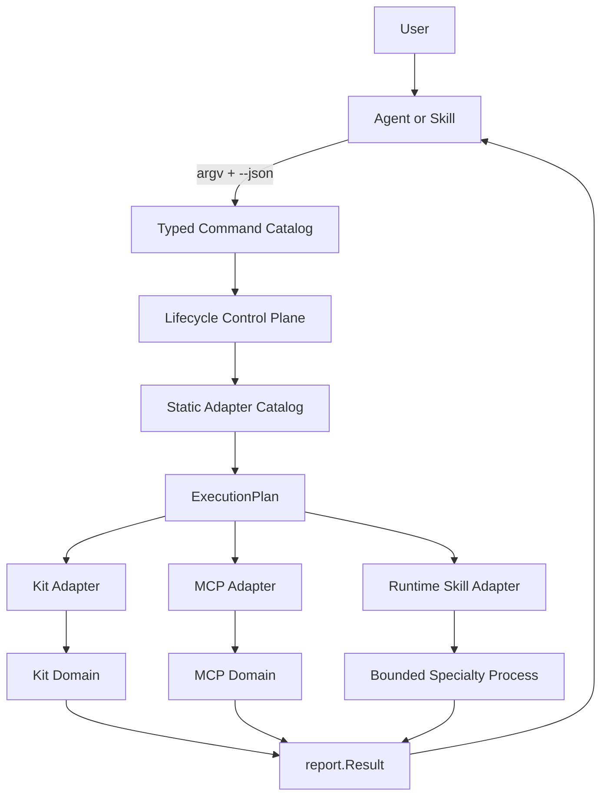

# CLI 与 MCP 控制面架构

Status: Accepted and Frozen

## 1. 控制面结论

AiCoding 仓库内的 Go CLI 是唯一产品控制面。Agent、Skill、Taskfile、Hook 和 CI 都是
调用者，不拥有安装、更新、同步、卸载、状态、验证或 rollback 规则。

MCP 是外部能力接入层，不是 AiCoding 产品工作流层：

```text
Agent / Skill --argv+JSON--> AiCoding CLI --typed values--> lifecycle/domain
Agent / Skill --MCP protocol--> MCP server --tools/resources--> external capability
```

两条通路不能反向耦合。MCP component 的 runtime 生命周期由 AiCoding 管理；MCP server
本身不注册 AiCoding workflow prompt，也不调用平台 lifecycle。

## 2. 为什么生命周期属于仓库

AiCoding 仓库拥有以下长期事实：

- Kit/MCP registry 与 manifest；
- Codex-Skills released gitlink、Marketplace binding 与 runtime profile；
- install state、managed markers、backup/rollback 证据；
- dependency、layout、DocSync、test 与 release governance；
- 单一 CLI/JSON/exit-code contract。

Agent 只拥有当前用户意图和会话上下文。让 Agent 自己安装或同步会产生多个不一致实现，
无法稳定回答“谁拥有文件、基于哪个 source、失败时恢复什么”。因此 Agent 只调接口，仓库
控制面负责把意图变成可审计 plan 与领域操作。

## 3. 实际调用链



CLI 的 typed command catalog 负责 command ID、alias、namespace、handler 和 help；
lifecycle 的 adapter catalog 负责 domain、input kind、state owner、entrypoint 与 action
effect；两者不是同一个 catalog，也不互相拥有领域逻辑。

## 4. 正式 Agent API

当前正式 Agent API 是本地进程 + JSON，不是 Go package、HTTP、gRPC 或 MCP control API。

调用规则：

1. 从 repo root 执行 `bin\aicoding.exe`；开发态可用 `go run ./cmd/aicoding`。
2. 总是传 `--json`，stdout 只接收一个 `report.Result` JSON 文档。
3. 退出码 `0` 表示 `ok=true`，`1` 表示 execution/validation failure，`2` 表示 usage error。
4. 调用者先检查 `schemaVersion`、`ok`、`errorKind`，再读取 `inputDigest`、`planDigest` 和
   `data`；不要通过解析人类文本判断成功。
5. 对 write action，先调用 `lifecycle plan`，保留摘要和结果，再经用户/策略允许调用 apply。
6. Agent 不直接导入 `internal/*`、运行底层 specialty 脚本或修改 state/plugin cache。

正式示例：

```powershell
# Kit
bin\aicoding.exe lifecycle plan --scope kit --action update --kit aicoding-platform --json
bin\aicoding.exe lifecycle update --scope kit --kit aicoding-platform --json
bin\aicoding.exe lifecycle status --scope kit --kit aicoding-platform --json

# MCP
bin\aicoding.exe lifecycle plan --scope mcp --action update --component visio-mcp --json
bin\aicoding.exe lifecycle update --scope mcp --component visio-mcp --json
bin\aicoding.exe lifecycle doctor --scope mcp --component visio-mcp --json
bin\aicoding.exe lifecycle verify --scope mcp --component visio-mcp --profile Smoke --json

# runtime Skill
bin\aicoding.exe lifecycle plan --scope runtime-skill --action update --runtime-profile full --json
bin\aicoding.exe lifecycle update --scope runtime-skill --runtime-profile full --json
bin\aicoding.exe lifecycle verify --scope runtime-skill --runtime-profile full --json
```

`--scope all` 是仓库级组合入口，但不提供跨领域原子事务：

```powershell
bin\aicoding.exe lifecycle plan --scope all --action update --runtime-profile full --json
bin\aicoding.exe lifecycle status --scope all --json
```

## 5. JSON 证据契约

正式 lifecycle 外层使用 `report.Result`，其 `data` 是 lifecycle report：

```json
{
  "schemaVersion": 1,
  "command": "lifecycle plan",
  "ok": true,
  "planDigest": "sha256:<plan>",
  "data": {
    "schemaVersion": 1,
    "action": "update",
    "mode": "plan",
    "scope": "mcp",
    "dryRun": true,
    "catalogDigest": "sha256:<adapter-catalog>",
    "planDigest": "sha256:<plan>",
    "ok": true,
    "summary": {
      "total": 1,
      "ok": 1,
      "failed": 0,
      "warnings": 0
    },
    "adapters": [
      {
        "id": "mcp",
        "action": "update",
        "dryRun": true,
        "inputDigest": "sha256:<registry-and-manifests>",
        "ok": true,
        "status": "planned",
        "data": []
      }
    ]
  },
  "elapsedMs": 1
}
```

三个摘要分别回答：

| 字段 | 回答的问题 | 不证明什么 |
|---|---|---|
| `catalogDigest` | 使用了哪组静态 adapter 契约 | 代码可信、已获授权 |
| `inputDigest` | 对哪组 registry/manifest/source facts 操作 | 外部 runtime 未变化 |
| `planDigest` | 选择了哪些 adapter、action 与稳定参数 | apply 已执行或成功 |

Digest 是完整性与可追踪证据，不是签名、授权或信任锚。权限、来源验证和运行结果必须独立
判断。这与 Git 中 object identity 不等于作者信任相同。

## 6. Lifecycle 语义

### 6.1 Plan 与 Apply

`lifecycle plan` 只允许 `install|update|uninstall`，内部将 action 保持不变并设置
`dryRun=true`。Apply 使用同一 action 与 selection；调用者可比较 plan/input digest，
但当前不承诺在两个独立进程之间自动 compare-and-swap。若需要跨进程 stale-plan 拒绝，
必须先定义真实并发场景与 expected digest 参数，不在本架构中预建。

### 6.2 Read 与 Write

Adapter descriptor 明确 action effect：

- read：`status`、`doctor`、`verify`，以及顶层 `plan`；
- write：`install`、`update`、`uninstall`、Kit `rollback`。

Runner 只执行 task，不解释 effect。Lifecycle 当前按 catalog 顺序、`MaxParallel=1` 调度，
保持写入安全与旧行为。只有只读路径的真实性能数据和线程安全契约同时具备，才能局部优化
并发；无需修改 Kit/MCP 领域实现。

### 6.3 Update 与 Sync

`update` 是公开 action，“sync”是领域内部收敛步骤：

| Domain | update 内部含义 |
|---|---|
| Kit | 根据 manifest 更新 install state；平台 Kit 可刷新 Marketplace managed plugin |
| MCP | 收敛 venv/package、Codex managed block 和 install state |
| runtime Skill | 收敛 selected profile、standalone junction 与重复 active source |

上游 source pin 或 Codex-Skills gitlink 更新属于维护/发布流程，不被 runtime `update` 偷偷执行。

### 6.4 Uninstall 与 Rollback

- uninstall 只能删除 registry/manifest 明确登记且 ownership 检查通过的资产；
- Kit rollback 恢复 last Kit state snapshot；
- MCP 在单次写操作内使用 config backup 与 staged runtime 恢复；
- runtime Skill 使用 specialty 实现自己的 backup/rollback manifest；
- lifecycle 不把局部恢复伪装成跨 Kit/MCP/Skill 的原子 rollback。

## 7. MCP 控制边界

### 7.1 AiCoding 管理的 MCP facts

```text
config/mcp-registry.json
  -> config/mcp/components/<component>.json
     -> runtime root / package / command / Codex registration / doctor / verify
```

Registry 与所有 referenced manifests 在一次命令中形成 `mcp-catalog` snapshot。选择、状态、
doctor、verify 与 lifecycle 消费同一批 decoded component values，不在执行中重新读取 manifest。

### 7.2 MCP server 的职责

MCP server 可提供：

- 领域 tools；
- 领域 resources；
- 协议 initialize/discovery；
- 领域级 doctor/verify endpoint。

MCP server 不提供：

- AiCoding install/update/uninstall workflow；
- profile、quality gate、release 或 rollback 编排；
- 指向上层 AiCoding identity 的反向依赖；
- workflow prompt registry。

Agent 先用 AiCoding CLI 保证 MCP runtime 处于期望状态，再用 MCP 协议调用领域能力。

## 8. Skill 控制边界

Skill 是 Agent 的工作流与领域纪律，不是 lifecycle authority：

- bundled `aicoding-*` Skills 通过 installed AiCoding plugin 暴露；
- standalone external Skills 通过 declared profile 和精确 source path junction 暴露；
- canonical source、generated package、plugin cache、standalone exposure 四种状态不能合并；
- Skill 可以调用 `aicoding lifecycle ... --json`，但不得复制脚本或直接调用未公开 Go 函数；
- Skill 处理用户意图、审批和多步编排，CLI 处理状态与所有权。

## 9. 扩展方式

### 新 MCP component

1. 增加 component manifest 与 registry entry。
2. 实现/验证组件 runtime 与 MCP protocol。
3. 运行 MCP module tests、lifecycle consumer tests 和相关 profile。
4. 不新增 CLI top-level command，不新增 adapter kind，不修改 runner/report。

### 新 external Skill

1. 在 Codex-Skills 通过 nested submodule 固定 source，并登记 binding。
2. 在 AiCoding profile/standalone registry 登记 runtime name 与精确 source path。
3. 使用 runtime Skill lifecycle plan/apply/audit。
4. 不复制 Skill source，不链接整个仓库，不直接编辑 plugin cache。

### 新领域类型

只有现有 Kit/MCP/runtime Skill 都无法表达时才允许：

1. 先定义领域 state owner、input facts 与 action/effect；
2. 增加具体领域模块和静态 adapter descriptor；
3. 以值对象接入 ExecutionPlan/Result；
4. 增加 module contract 与 lifecycle consumer regression；
5. 不修改 snapshot/runner/report 领域无关契约。

详见 [Extension Adapter Contract](EXTENSION_ADAPTER_CONTRACT.md)。

## 10. 接口演进与停止规则

当前 local process + JSON 已覆盖 Agent、Skill、Taskfile、Hook 和 CI，它们是同一类本地调用者，
不是多个独立 transport consumers。因此不增加服务 API。

只有出现第二个独立 transport consumer、真实并发/远程授权需求，以及可复用的稳定 command
request/result contract 时，才评估新的 transport adapter。新的 transport 只能调用现有
control plane，不能成为第二 lifecycle。

CLI/MCP 控制面至此冻结。后续 component/Skill 增减是功能扩展；adapter 内部性能优化是
模块维护；都不触发控制面重写。
