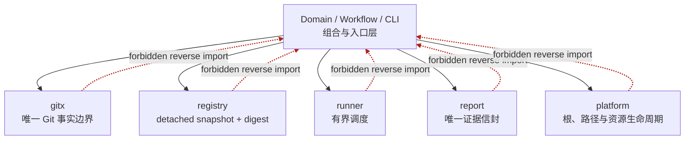

# Primitive 宪法（Architecture Constitution）

Status: Accepted and Frozen

> 本文是 AiCoding 所有新增功能、重构、优化与 Bug 修复的**设计与评审法**：任何改动在
> 设计、编码、评审、重构过程中都必须持续满足以下 12 条约束。它不定义具体契约（契约在
> [核心架构](AICODING_CORE_ARCHITECTURE.md) 等文档），而是约束"任何 Primitive 该长什么样"。
> 与契约文档冲突时以契约文档为准；本文只收紧、不放宽。

## 定位（与其它文档的关系，避免重复）

- **是什么**（契约事实）：六模块、动词表、JSON 契约、冻结面 → [核心架构](AICODING_CORE_ARCHITECTURE.md)、[FREEZE_AND_ACQUISITION_BOUNDARY](FREEZE_AND_ACQUISITION_BOUNDARY.md)。
- **怎么进来**（扩展路径）：Kit/MCP/新领域 adapter → [EXTENSION_ADAPTER_CONTRACT](EXTENSION_ADAPTER_CONTRACT.md)。
- **该长什么样**（本文）：任何 Primitive 必须满足的单一职责、执行成本、Fast Path、可观测、可组合等品质约束。

一句话：**Small Core · Fast Primitive · Low Cost · Stable Interface · Free Composition。**
让 AiCoding 像 Git 一样，以极少而高质量的 Primitive 组合出丰富工作流，而非靠功能堆叠。

## Primitive 依赖方向图

这张图只回答五个 Primitive 各自做什么，以及依赖为什么只能由上层指向 Primitive。
红色虚线是机器治理必须拒绝的反向 import。

## 12 条约束

### 1. Primitive First
禁止为新需求直接加复杂流程、大模块或特例逻辑。先分析能否复用已有 Primitive；不能才抽象
新 Primitive，且必须有长期复用价值，而非只服务当前场景。

### 2. Single Responsibility
每个 Primitive 只完成一个明确目标。禁止：一个 Primitive 兼做多业务 / 含互不相关逻辑 /
按参数切换成不同功能 / 隐式承担 Workflow 职责。发现多职责立即拆分。
（范例：repo-context 的 `status`=新鲜度、`doctor`=完整性、`verify`=结构，各司其职，
见 [ADR 0003](../decisions/0003-repo-context-domain.md) §5。）

### 3. Execution Cost First
执行成本是架构的一部分，先分析执行成本、再谈实现成本。必须最小化：CPU、内存、文件 IO、
Git 操作、Token、Agent 推理轮数、Context 长度、工具调用、网络请求、外部进程启动。
禁止：用全仓扫描解决局部问题、用全量解析解决增量问题、重复读取相同数据、重复生成相同
结果、为少量数据构建巨大上下文、无意义调用 Agent/外部工具、为简单任务启动复杂 Workflow。
**默认选执行成本最低的实现，而非实现最简单的方案。**

CLI 延迟预算是接口契约，登记在唯一 typed command catalog 的 `LatencyClass`，不得另建
平行预算文件：`fast` warm 中位数 <400ms，`standard` <1200ms，`work` 不设绝对上限但须
支持已有的内容证据复用。命令变慢一档必须作为接口回退评审。`doctor perf` 对 fast/standard
代表路径各执行 3 次取中位数，超过预算 1.5 倍 Warn、3 倍 Fail；环境或工具链主导的 work
路径不能靠削减验证内容换取达标。

### 4. Fast Path First
优先设计最快执行路径：增量、按需加载、缓存复用、局部处理、并行、零重复计算。只有 Fast
Path 不满足时才进入更复杂流程。**"最快"须由测量证据支撑**（先测后改），不靠直觉。

### 5. Do One Thing Well
默认只完成一项工作。禁止自动执行额外任务 / 自动扫描整个工程 / 自动修改其它模块 / 自动生成
任务外内容 / 隐式调用多个业务流程。附加行为由 Workflow 主动组合，不由 Primitive 自决。

### 6. Minimum Input · Minimum Output
只接收完成当前任务所需的最小输入（无无关参数/配置/上下文/状态）。输出标准化、确定、
易组合，不夹带任务无关信息。

### 7. Deterministic
相同输入必须得到完全相同输出。禁止随机、时间依赖、顺序依赖、非必要环境/网络依赖。
（机制：`Facts`/`Manifest`/生成物排序、无时间戳、无绝对路径 → digest 恒等；耗时等
非确定性元数据只进信封，不进 deterministic payload。）

### 8. Interface Stability
Primitive 发布后接口长期稳定，只允许新增能力（附加字段等）。禁止随意改参数/返回格式/
命令名/目录结构。**兼容优于重写。**（冻结面见 [FREEZE_AND_ACQUISITION_BOUNDARY](FREEZE_AND_ACQUISITION_BOUNDARY.md)。）

### 9. Composition First
复杂能力由多个 Primitive 组合。禁止"万能命令"或"超级 Primitive"。编排/调度/生命周期/
条件/重试/并发归 Workflow；Primitive 只负责自己的职责。

### 10. Independent & Testable
每个 Primitive 必须能独立：运行、测试、Benchmark、Mock、发布、复用。禁止只能在整个
系统里才能验证。

### 11. Observable
每个 Primitive 必须能明确输出：输入、输出、执行耗时、资源消耗、错误原因、返回状态。
禁止黑盒。（机制：命令级 `report.Result.elapsedMs` → 领域级 `lifecycle.adapters[].elapsedMs`
→ 热点级 `Benchmark*`；状态用 `ok`/`errorKind`/退出码程序化判读。）

### 12. Architecture Review Checklist
每完成一个 Primitive，必须逐项自评（下节）。任一项为否即继续重构，直到全部满足。

## 评审 Checklist（每个 Primitive 必答）

**架构**
- [ ] 是否真正只有一个职责？
- [ ] 是否可以继续拆分？
- [ ] 是否能被其它模块直接复用？
- [ ] 是否存在重复实现？
- [ ] 是否真的需要新增 Primitive？

**性能**
- [ ] 是否存在 Fast Path？
- [ ] 是否有无关扫描？
- [ ] 是否有重复 IO？
- [ ] 是否有重复计算？
- [ ] 是否有重复 Agent 调用？
- [ ] 是否有重复工具调用？
- [ ] 是否使用最小 Context？
- [ ] 能否进一步降低 Token / 文件读取 / Git 操作 / 进程启动？

**质量**
- [ ] 是否保持确定性？
- [ ] 是否保持接口稳定？
- [ ] 是否达到最小输入 / 最小输出？
- [ ] 是否能独立测试 / 独立 Benchmark？
- [ ] 是否能自由组合？

## 如何执行（Convention）

- **新 Primitive / 新领域**：其 ADR 必须包含一节"§12 Checklist 自评"，逐项以**具体证据**
  回答（测试名、benchmark 数字、扫描次数、复用了哪个已有 Primitive）。范例见
  [ADR 0003](../decisions/0003-repo-context-domain.md) 的自评节。
- **重构 / 优化 / 修复**：在评审中引用本文对应条款；性能主张必须附测量证据（先测后改）。
- **冲突裁决**：本文与契约文档冲突时以契约文档为准；本文只收紧。

## 最终目标

Primitive 不只是最小功能单元，更是系统中**执行成本最低、性能最高、组合能力最强**的基础
构件。高级功能由多个高质量 Primitive 自然组合产生，而非靠膨胀的大模块或万能命令扩张。
