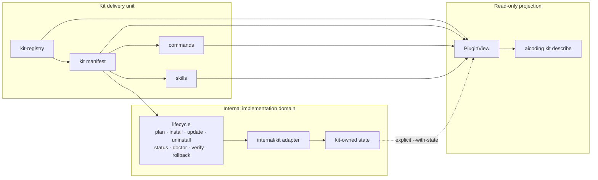

# Kit Plugin View（消费者侧只读投影）

## 1. 定位

`Plugin View` 是面向用户和 Agent 的 Kit 能力只读投影，不是新的 runtime domain、Manifest、
registry、生命周期、动态 Go plugin ABI 或控制面。生产者如何把新能力接入平台，见
[Plugin SDK](../architecture/06-plugin-sdk.md)；快速入门与维护要求见
[Kit 管理标准](KIT_MANAGEMENT_STANDARD.md)。本文只规定消费者如何查看已经登记的能力。

这张图回答 Kit 交付单元如何投影为只读视图，以及它与 `internal/kit` 实现域的边界。
Kit 事实来自 registry/manifest；八动词与 owned state 仍由内部实现域负责。



禁止新增 `plugin.yaml`、Plugin Registry、Workflow Registry、权限数据库、第二 Report Schema
或 `internal/plugin`。v1 不注入 MCP 字段：Kit manifest 当前不声明 MCP 依赖，擅自关联会制造
不存在的 Kit↔MCP 事实。

## 2. 消费者

- 用户：判断 Kit 解决的问题、包含的 Skill，以及哪些操作只读或会写入状态。
- Agent：获得稳定 identity、operation effect、state owner、entrypoint 和 Workflow 定位。
- 维护者：只维护既有 registry、manifest、Skill、typed command catalog 和 adapter catalog。

## 3. 唯一事实来源

| 信息 | 权威源 |
|---|---|
| Kit 注册、启用状态与顺序 | `config/kit-registry.json` |
| Kit 名称、版本、kind、mode、description、trust | `config/kits/*.json` |
| 可选外部 source pin 与 source identity | 同一 Kit manifest 的 `source` 及其规范化内容身份 |
| Quickstart 目的、首个 read command、Skill 摘要 | 同一 manifest description/commands/skills 的派生投影 |
| Skill 身份、角色、描述、标签与路径 | Kit manifest；解析复用 `internal/kit.parseSkillEntries` |
| Workflow 定位 | manifest Skill 路径与权威 `SKILL.md` 的二级标题 |
| 顶层命令与 help | `internal/cli` Typed Command Catalog |
| lifecycle action、effect、entrypoint、state owner | `internal/lifecycle` Static Adapter Catalog |
| state | Kit domain 的 `install-state.json`，仅显式查询 |
| JSON envelope | `internal/report.Result` |

`kit list` 是一行一个 Kit 的注册表索引投影；`kit describe` 是单 Kit 或全量深投影。
二者的 identity 均走 `CatalogKitViews` 构造路径，不平行拼装 registry/manifest 身份。

## 4. 输出字段与派生规则

### 4.1 Identity 与定位

`id`、`name`、`identity.enabled/order/version/kind/mode` 和 source manifest 来自
`CatalogKitViews`；`description` 与 `identity.trust` 来自同一 detached manifest。存在 pinned
source 时，`source.pin` 投影规范化的 pin，`source.identity` 投影稳定内容身份；二者都不包含
cache 或 materialization 绝对路径。

### 4.2 Skills 与 Workflows

`skills` 复用 manifest Skill 解析结果，并按 Skill ID 排序。`workflows` 只输出：

```json
{
  "skill": "aicoding-kit-maintenance",
  "path": "CodingKit/.../SKILL.md",
  "sections": ["When to use", "Workflow", "Verification"]
}
```

实现对每个 `SKILL.md` 单次顺序扫描，同时取得 frontmatter 与所有 `## ` 标题；不使用正则
回溯、不复制章节正文、不建立 Workflow DSL。路径解析保持有界：先使用仓库本地文件；文件不在
仓库时，仅允许从已经解析并校验的本地 pin cache 读取。未预取不能被当作路径存在。

### 4.3 Quickstart

`quickstart` 不是 manifest 字段或文件，只从同一 detached manifest 派生：`purpose` 复用
description，`command` 取按名字排序的首个 read operation 并渲染为现有 typed CLI 调用，
`skills` 复用 Skill ID 与 description。无 Skill 时输出稳定空数组；没有 read command 时管理
门禁失败。完整管理契约见 [Kit 管理标准](KIT_MANAGEMENT_STANDARD.md)。

### 4.4 Operations（per-kit）

operation 名字只来自 `Manifest.Commands`，且必须属于
`allowedManifestCommandNames`。effect 的唯一解析规则是：

```text
同名 lifecycle kit adapter action 存在 -> 使用 adapter Effect
否则                               -> 使用 internal/kit 唯一 manifestCommandEffect 表
stateOwner / entrypoint             -> 使用 lifecycle kit adapter descriptor
```

静态补充表只含 read/write 二值：

| Manifest command | Effect |
|---|---|
| `install` / `update` / `uninstall` | write |
| `status` / `doctor` / `verify` | read |
| `export` | write |
| `test` / `skills` / `verify-skills` | read |

### 4.5 Lifecycle actions（scope 级）

`lifecycleActions` 逐项投影 Static Adapter Catalog 的 Kit descriptor，并固定
`scope: "kit"`。它对所有 Kit 一致，不表示某个 Kit 独有。当前 catalog 包含
`install/update/uninstall/status/doctor/verify/rollback`；`plan` 是控制面对目标 action 生成
候选意图的元操作，不在 adapter action descriptor 中，因此 View 不虚构 `plan` action。

effects 只允许 `{effect: read|write, stateOwner, entrypoint: go-static|bounded-process}`，
不增加自由文本权限标签。

### 4.6 State 与 digest

默认不读 state。只有 `--with-state` 才输出稳定摘要
`{kitId, version, action, installed, sourceIdentity?}`；`installedAt`、`updatedAt`、绝对 cache path
和 materialization path 不进入 View。

`report.Result.inputDigest` 只组合 detached Kit catalog digest 与 adapter catalog digest。
state、耗时和 repo 绝对路径不参与摘要，因此显式读取 state 也不会污染输入身份。

## 5. Skill Workflow 文档契约

公开 Skill 建议使用稳定章节：

```markdown
## When to use
## Inputs
## Workflow
## Read operations
## Write operations
## Verification
## Completion criteria
## Failure and rollback
## Constraints
```

这是文档契约，不是 Workflow DSL。只有至少两个独立真实消费者需要同一机器格式，并经 ADR
证明 Markdown 不足时，才评估结构化步骤、回滚或成功条件。

## 6. 只读命令

```text
aicoding kit describe --kit <kit-id> [--with-state] [--repo-root PATH] [--json]
aicoding kit describe --all [--with-state] [--repo-root PATH] [--json]
```

- 选择逻辑复用 `CatalogSnapshot.Select`；`--kit` 与 `--all` 互斥。
- `data` 始终为 `[]PluginView`，单 Kit 时也不切换成单值。
- 未知 ID 返回 `ok:false`、`errorKind:validation` 和稳定的 `no kit matched`。
- 命令不执行 lifecycle、不写 state、不扫描未登记目录。

## 7. JSON 契约

Plugin View 位于既有 `report.Result.data`：

```json
{
  "id": "aicoding-platform",
  "name": "AiCoding Platform",
  "description": "...",
  "quickstart": {
    "purpose": "...",
    "command": "aicoding lifecycle status --scope kit --kit aicoding-platform --json",
    "skills": []
  },
  "identity": {
    "enabled": true,
    "order": 10,
    "version": "0.1.0",
    "kind": ["platform-kit", "plugin-kit"],
    "mode": "go-builtin",
    "trust": "first-party"
  },
  "skills": [],
  "operations": [],
  "lifecycleActions": [],
  "workflows": [],
  "source": {"manifest": "config/kits/aicoding-platform.json"}
}
```

Pinned Kit 的 `source` 形状示例：

```json
{
  "manifest": "config/kits/external-kit.json",
  "pin": {
    "kind": "git",
    "url": "https://example.invalid/upstream.git",
    "commit": "0123456789abcdef0123456789abcdef01234567"
  },
  "identity": "sha256:<64-hex>"
}
```

Kit 按 registry `order`，各数组按稳定 ID/名字字典序输出。

## 8. 质量门禁

门禁落在 `internal/kit.VerifyCatalogStructure` 的 `plugin view projection` StructureCheck，
不新建 validator 或命令。它检查：

1. enabled Kit 的 manifest description 非空且不以内部实现开头；
2. Skill description 非空且登记路径满足“仓库本地文件存在，或已解析 pin 中存在”，
   umbrella/member 角色沿用既有结构校验；
3. enabled Kit 至少有一条 read command，且 `quickstart` 可从现有事实完整派生；
4. enabled Kit 的 `trust.updatePolicy` 属于 `manual|pinned|tracked`；外部包装 Kit 存在约定边界卡；
5. 每个 manifest command 有唯一 read/write effect；
6. 每个 write operation 有 adapter state owner；
7. 当 `external-command` 调用 `aicoding(.exe)` 时，`args[0]` 必须存在于 Typed Command
   Catalog；调用 `go` 等真正外部工具时不把其参数误当 AiCoding 命令；
8. 投影不宣传已移除的兼容命令。

`kit verify --level smoke` 将新增问题报告为 warnings；`--level lifecycle` 为 errors。官方 Full/Release
测试同样执行 Lifecycle 结构用例，因而保持阻断。验证必须使用：

```powershell
bin\aicoding.exe kit verify --all --level lifecycle --json
```

## 9. 完成定义

- 冻结的 snapshot / plan / runner / adapter / report / state 契约不变；
- 没有新增 Primitive、runtime domain、Manifest authority 或 lifecycle accessor；
- `internal/kit` 不依赖 `internal/lifecycle`，adapter 由 CLI 转为纯值；
- 所有已注册 Kit 可投影，重复执行 deterministic payload 与 inputDigest 一致；
- describe 前后工作区不变，governance、DocSync、Smoke 与 Full 门禁通过。
