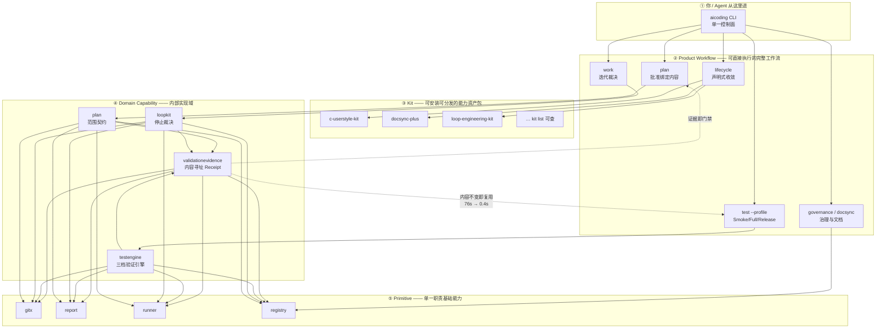

# TODO 0025: 架构图体系（README 总图 + 四张分层图）

Status: Planned
Verify: README 总图与 docs/architecture/ 四张分层图全部为 Mermaid 源码、GitHub 原生渲染、lychee 链接全通；每张图节点数 ≤20

> 来源：owner "当前 README 那张图我根本看不懂"。
> 病根：现有图把**执行链**画成一条线，但读者要回答的是
> **"我该用哪个命令、它靠什么支撑、凭什么可信"**——这三问需要分层，不是一条链。

## 一、总图（进 README，替换现有架构图）

设计原则：**一张图回答三个问题**——用户从哪进、能力怎么分层、结论凭什么可信。



**图要传达的三件事（配图文字，各一行）：**

```text
① 只有一个入口     所有能力都从 aicoding CLI 进，没有第二控制面
② 能力分五层       上层组合下层，下层永不反向依赖
③ 证据形成闭环     验证结论绑定 Git 内容身份，同一内容零成本复用（虚线回边）
```

## 二、四张分层图（进 docs/architecture/）

每张图独立回答"这一层是什么、怎么用、边界在哪"，**≤20 节点**，
放进各自已有的架构文档，不新建文档。

### 图 1：Primitive 层 → `docs/architecture/PRIMITIVE_CONSTITUTION.md`

画：五个 Primitive 各自的单一职责 + 禁止的反向依赖边（红色虚线标注 forbidden）。
重点是**依赖方向**，因为这层唯一要守的就是方向。

### 图 2：Domain Capability 层 → `docs/architecture/AICODING_CORE_ARCHITECTURE.md`

画：六模块（snapshot/plan/runner/adapter/report/state）与四个域能力的对应关系。
重点是**哪些是冻结的**（加粗/实线）vs **哪些是扩展位**（虚线）。

### 图 3：Kit 层 → `docs/reference/KIT_PLUGIN_VIEW.md`

画：kit-registry → manifest → commands/skills/state → lifecycle 八动词 的投影链。
重点是 **Kit 与 internal 域的区别**（Kit 是交付单元，internal 是实现域）。

### 图 4：Product Workflow 层 → `docs/COMMANDS.md`

画：一次完整开发闭环的命令时序——
`plan check → 改代码 → change verify → plan approve → commit → pre-push gate`。
重点是**每一步谁在裁决、裁决依据是什么**。

## 三、实现约束

1. **全部 Mermaid 源码**，GitHub 原生渲染，零图片维护（0012 已定的规则）。
2. **≤20 节点/图**，超了就是该拆——图的价值在于看得懂，不在于画得全。
3. **总图进 README 的生成区之外**（它是手写的架构表达，不是投影），
   但 **Kit 列表用 0023 的生成区**，两者不混。
4. 每张图配 **≤3 行文字**说明"这张图回答什么问题"，不写解说词。
5. 图中出现的每个命令必须在 typed command catalog 中真实存在
   （新增 static 用例 `DOCS-006` 校验：扫描架构文档中的 `aicoding xxx`
   代码片段，断言命令名 ⊆ catalog）。

## 四、明确不做

- 不用 SVG/PNG 画架构图（只有 banner 用 SVG，0012 已定）。
- 不画时序图/类图/ER 图（当前无消费者）。
- 不为每个 internal 包画图（0023 已裁决：无公共入口的域零新增文档）。
- 不做图的自动生成（依赖关系图有 `governance dependencies` 的 JSON，
  想看的人可以查；渲染成图无第二消费者）。

## 五、自测

```powershell
bin\aicoding.exe docsync all --json          # 架构文档 Status 与链接
lychee --config lychee.toml README.md docs/  # 图中链接全通
bin\aicoding.exe test --profile Full --json  # 含 DOCS-006
#   DOCS-006 负例：在架构文档里写 `aicoding nonexistent` → 必须红 → 撤销后转绿
#   节点数断言：脚本统计每个 mermaid 块的节点数 ≤20
```

通过判据：五张图全部 GitHub 渲染正常（贴截图或渲染确认）；
DOCS-006 负例被抓；每图 ≤20 节点；README 总图与四张分层图无内容重复
（总图只画层与闭环，细节全在分层图）。

